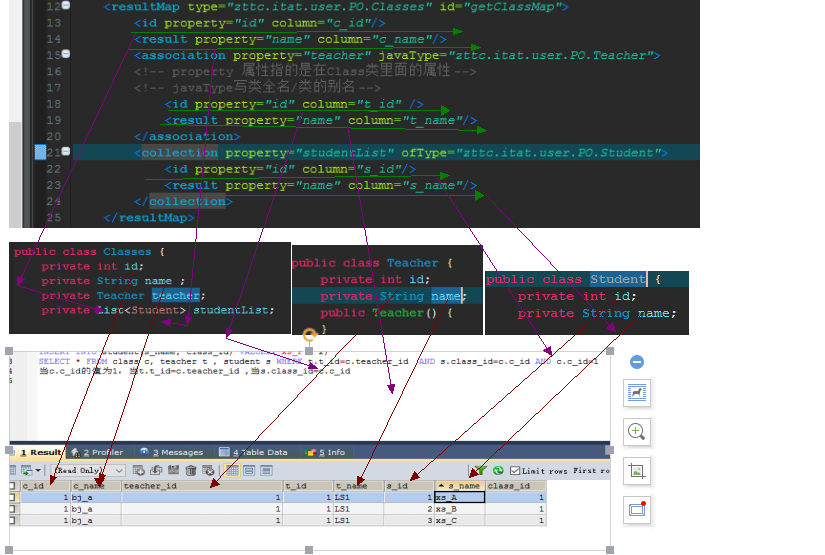

## MyBatis-note

## 2.1 添加jar包

（1）导入jar
（2）若是maven项目直接添加依赖

- mysql的jar也要添加

```xml
<dependency>
    <groupId>org.mybatis</groupId>
    <artifactId>mybatis</artifactId>
    <version>3.4.1</version>
</dependency>
```

## 2.2 建库+表

```mysql
create database mybatis;
use mybatis;
CREATE TABLE users(id INT PRIMARY KEY AUTO_INCREMENT, NAME VARCHAR(20), age INT);
```

## 2.3 添加MyBatis的配置文件conf.xml到src目录下

```xml
<?xml version="1.0" encoding="UTF-8"?>
<!DOCTYPE configuration PUBLIC "-//mybatis.org//DTD Config 3.0//EN" "http://mybatis.org/dtd/mybatis-3-config.dtd">
<!--约束-->
<configuration>
	<environments default="development">
      <!--
		工作模式:work
		开发模式:development
-->
		<environment id="development">
			<transactionManager type="JDBC" />
			<!--
			事务管理类型：
				JDBC
				MANAGED
-->
			<dataSource type="POOLED">
              <!--
			数据源类型：
				POOLED：使用连接池
				UNPOOLED：不使用连接池
-->
			<!--
			数据源的属性：
			driver
			url
			username
			password
-->
				<property name="driver" value="com.mysql.jdbc.Driver" />
				<property name="url" value="jdbc:mysql://localhost:3306/mybatis" />
				<property name="username" value="root" />
				<property name="password" value="root" />
			</dataSource>
		</environment>
	</environments>
</configuration>
```

## 2.4 定义表所对应的实体类

## `重要`2.5 定义操作users表的sql映射文件userMapper.xml

```xml
<?xml version="1.0" encoding="UTF-8" ?>
<!DOCTYPE mapper PUBLIC "-//mybatis.org//DTD Mapper 3.0//EN" "http://mybatis.org/dtd/mybatis-3-mapper.dtd"> 
<mapper namespace="com.atguigu.mybatis_test.test1.userMapper"> 
	<select id="getUser" parameterType="int" 
		resultType="com.atguigu.mybatis_test.test1.User">
      <!--select标签
		resultType是由反射实现的因此应该写该类的全类名
-->
		select * from users where id=#{id}<!--占位符-->
	</select>
</mapper>
```

namespace是id，要确保他是唯一的，故其值应该是包名加这个文件名不加后缀（com,zttc.itat.mybatis.UserMapper）
映射文件放在与User同级目录下

## 2.6 在conf.xml文件中注册userMapper.xml

```xml
 <mappers>
		<mapper resource="userMapper.xml"/>
		<!-- 是路径结构而不是包的结构 ，应该是这个mapper相对于conf.xml的相对路径-->
	</mappers> 
```

`重要`**conf.xml和userMapper.xml此类资源文件都会放在maven项目的src/main/resources项目下，而这里mapper的resources的值是一个相对路径**
最好不要放在其他文件下

## 小结（理解）
- -准备：conf.xml注册------->Mapper.xml的定义（namespace和mapper）
  - 1.conf.xml里面----->注册userMapper.xml资源文件
  - 2.userMapper.xml里面----->定义这个文件：
    - 2.1 最基本的两个部分：
      - 2.1.1.（mapper的属性值）namespace:命名空间，要指定映射的接口类类名（全类名）
      - 2.1.2（mapper标签里面的的一些设置）执行SQL语句是怎么定义的
    - 2.2 一个标签可以映射接口的一个方法，一般其id可以与该方法同名比较方便
      - 2.3select标签里面写入语句
    - 2.4ps:语句格式：（注意语句格式#{id}用占位符来作为该方法的参数
- 开始：Resource------->Factory------->session------->mapper
  - 1.由Resource对象获取资源文件conf.xml的一个输入流，将输入流传给建造SqlSessionFactory
     一个数据会话工厂类的一个构造器（builder）以获得一个工厂类 
  - 2.由这个工厂类得到一个session
  - 3.将UserMapper对象的类对象（里面有UserMapper对象的信息）传入     -       session的getMapper方法
     （返回一个泛型，可以用接口引用）得到一个mapper
  - 4.这个mapper对象的方法可以根据userMapper.xml的定义得到预期的结果
##优化
 ### 配置文件单独放在一个properties
 1.在conf.xml同级目录写下文件jdbc.properties
 2.在conf.xml设置，然后用EL表达式使用
	<properties resource="jdbc.properties"></properties>
	<propertiy name="driver" value="${driver}"/>
 ### 为实体类定义别名
	<typeAliases>
		<!-- <typeAlias type="zttc.itat.user.mybatis.User" alias="_User"/> -->
		<package name="zttc.itat.user.mybatis"/>
	</typeAliases>
##解决字段名与实体类属性名不同的冲突

###解决方式1
直接在sql语句上设置别名
`	select order_id id, order_no orderNo,order_price price from orders where order_id=#{id}`
###解决方式2
在mapper.xml里面的resultMap标签设置键值对，然后使想要执行的语句所在标签加上属性（resultMap的id值）
```xml
<select id="selectOrderResultMap" parameterType="int" resultMap="orderResultMap">
	select * from orders where order_id=#{id}
</select>
<resultMap type="_Order" id="orderResultMap">
	<！--
		resultMap ：封装一些映射关系
			id:专门针对主键
			result:针对一般字段
	-->
	<id property="id" column="order_id"/>
	<result property="orderNo" column="order_no"/>
	<result property="price" column="order_price"/>
</resultMap>
```

## 一对一查询

### 联表查询

### 两次查询

重点是`<association>`标签的属性设定

<association>定义了一个对象 

 - association的属性：property，javaType，select，resultSet
 - association内含在里面的标签：id,result(他们会有propety，column)

```xml
<mapper namespace="zttc.itat.user.test5.ClassMapper"> 
	<!-- 
	方法1.联表查询(嵌套结果)
    select * from class c,teacher t where c.teacher_id = t.t_id AND c.c_id = 1
	 -->
	<select id="getClass" parameterType="int" resultMap="getClassMap">
	 select * from class c, teacher t where c.teacher_id = t.t_id and c.c_id=#{id}
	</select>
	<resultMap type="zttc.itat.user.PO.Classes" id="getClassMap">
		<id property="id" column="c_id"/>
		<result property="name" column="c_name"/>
		<association property="teacher" javaType="zttc.itat.user.PO.Teacher">
		<!-- property 属性指的是在Class类里面的属性->
		<!--column属性是在数据库查询结果中数据对应的字段名-->
		<!-- javaType写类全名/类的别名 -->
			<id property="id" column="t_id" />
			<result property="id" column="teacher_id"/>
			<result property="name" column="t_name"/>
		</association>
	</resultMap>
<!--  
方法2. 执行两次查询（嵌套查询）
    select * from class where c_id = 1;
    select * from teacher where t_id = 1;
-->
	<select id="getClass2" parameterType="int" resultMap="getClass2Map">
	 	select * from class where c_id = #{id}
	</select>
	<select id="getTeacher" parameterType="int"  resultType="zttc.itat.user.PO.Teacher">
    	select t_id id , t_name name from teacher where t_id = #{id}
	</select>
	<resultMap type="zttc.itat.user.PO.Classes" id="getClass2Map">
		<id property="id" column="c_id"/>
		<result property="name" column="c_name"/>
		<association property="teacher" column="teacher_id" select="getTeacher" >
		<!-- property 属性指的是在Class类里面的属性
			 column是指在数据库查询结果里面这个association对应的一个字段，然后再通过这个字段来查询，这个时候select属性指定到select标签的一个id		
		-->
		</association>
	</resultMap> 
</mapper>
```

## 一对多查询

最重要的是`<collection>`标签

- 属性property、column、ofType

- 内置标签`<id>`这是主键、`<result>`这是一般字段，他们的property和column也需要设置

  - 对resultMap的理解

    

    事实上resultMap会将数据库查询得到的表的字段一一对应上这个类的各个属性，包括基本类型和包装对象类型

    | 属性          | 描述                                       |      |
    | ----------- | ---------------------------------------- | ---- |
    | property    | 需要映射到JavaBean 的属性名称。                     |      |
    | column      | 数据表的列名或者标签别名。                            |      |
    | javaType    | 一个完整的类名，或者是一个类型别名。如果你匹配的是一个JavaBean，那MyBatis 通常会自行检测到。然后，如果你是要映射到一个HashMap，那你需要指定javaType 要达到的目的。 |      |
    | jdbcType    | 数据表支持的类型列表。这个属性只在insert,update 或delete 的时候针对允许空的列有用。JDBC 需要这项，但MyBatis 不需要。如果你是直接针对JDBC 编码，且有允许空的列，而你要指定这项。 |      |
    | typeHandler | 使用这个属性可以覆写类型处理器。这项值可以是一个完整的类名，也可以是一个类型别名。 |      |

    总结：
  - select
   - 属性：
     - id
     - resultMap/resultType（返回结果类型，复合对象类型用resultMap，普通对象类型用resultType）
     - parameterType/parameterMap（传入参数类型，复合对象类型用parameterMap，普通对象类型用parameterType）`ps`但是这里parameterMap貌似非常少用
    - resultMap
      - 属性：
        - Type 映射的一个JavaBean类
        - id 可以供全局调用的唯一标识符
      - 内置标签：
        - id 主键
        - result 一般字段
        - association
        - collection
        - discrimitor
        - constructor
## 动态SQL与模糊查询
这一节讲解了`<if test=""></if>`标签的使用
并且说明：在xml类型的文件中单引号应该在双引号外
此节的讲解类似于jstl标签库在jsp里面的使用

测试代码：我们可以看见selectOne返回值为空，传入的parameterMap对应的值发生了改变
```java
	public static void main(String[] args) throws IOException {
		SqlSessionFactory f = MybatisUtils.getFactory2();
		SqlSession session = f.openSession();
        String statement = "zttc.itat.user.mybatis.UserMapper3.getUserCount";
		Map<String ,Integer> parameterMap = new HashMap<String, Integer>();
		parameterMap.put("userid", 2);
		parameterMap.put("count", -1);
		Integer result = session.selectOne(statement, parameterMap);
		System.out.println(result);
		System.out.println(parameterMap.get("count"));
		session.close();
	}
```

```xml
<?xml version="1.0" encoding="UTF-8" ?>
<!DOCTYPE mapper PUBLIC "-//mybatis.org//DTD Mapper 3.0//EN" "http://mybatis.org/dtd/mybatis-3-mapper.dtd"> 
<mapper namespace="zttc.itat.user.mybatis.UserMapper3"> 

	<select id="getUserCount" parameterMap="getUserCountMap" statementType="CALLABLE">
	CALL mybatis.ges_user_count(?, ?)
	<!--这里问号的顺序是下面<parameter>的parameter顺序-->
	</select>
	<parameterMap type="java.util.Map" id="getUserCountMap">
		<parameter property="userid" mode="IN" jdbcType="INTEGER"/>
		<parameter property="count" mode="OUT" jdbcType="INTEGER"/>
	</parameterMap>
</mapper>
```
## 9. MyBatis缓存

当查询数据在缓存中能得到时，直接从缓存中获得

## 一级缓存

session范围的缓存（必须是同一个session）
1.session.close没有被调用
2.查询的是同样的数据
3.session.clearcache没有被调用
4.没有执行过增删改的操作
二级缓存
factory范围的缓存
不是默认开启的需要：
添加一个cache在Mapper.xml里面

## 10.关于搭建项目的问题

定义了接口之后
应该写一个实现类，将从session里get到的Mapper代理类来得到各个方法的返回值。
 


