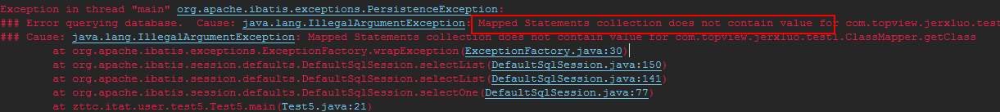
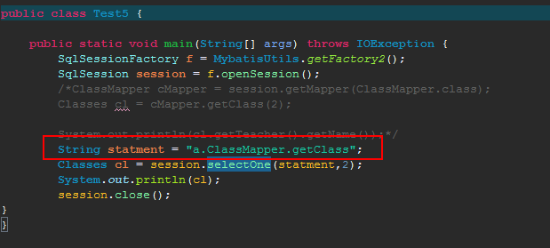
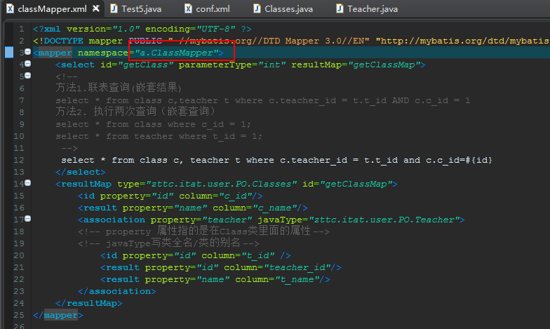
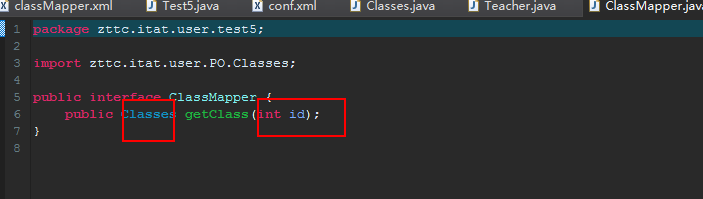
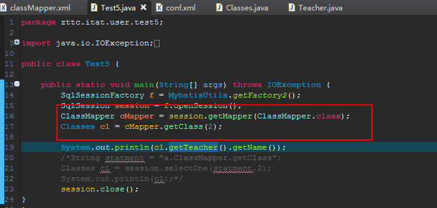
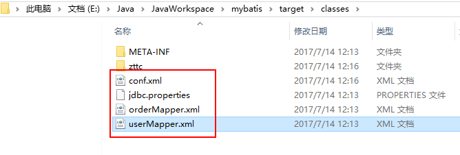

Mapped Statements collection does not contain value for com.topview.jerxluo.test1.
错误原因：在测试代码中，statement写错位置= = 
从中得出所谓的逻辑原理：

1. 首先conf.xml和mapper.xml,mybatis的配置文件和映射文件放在同一个目录下：src/main/resources，由此当我们在conf.xml注册映射文件的时候mapper标签的resources属性可以直接写mapper.xml的文件名（这里衍生出一个问题：在**conf.xml里面如何正确注册一个映射文件**）

2. 在mapper.xml映射器里面的namespace命名空间事实上是可以任意设置的,在测试的时候传入session（数据库会话）的statement是让会话，在这个命名空间a.Classmapper，找到一个id为getclass的一个标签，通过映射关系得到查询结果。（在这里又有一个问题namespace命名空间是一个什么样的存在）

   



3.当命名空间设置成对应的一个接口的全类名的时候（此时ClassMapper是一个含有getClass方法的接口，getClass方法的形参和返回值与在mapper.xml所对应的一致）



这个时候，我们可以直接向session的一个getMapper方法提交这个ClassMpper的类对象，然后mybatis就会根据这类对象，**去查找相应的命名空间**，为我们写一个ClassMapper实现类，作为getMapper的返回值，只要接口的方法与映射器配置文件的设置完全对应则可以以接口作为对象引用来调用方法= =



## 问题解决

1.正确注册一个mapper映射器

- 可以在src/main/resource里面放置一个mapper.xml文件
  然后官网上说明：

  **最佳的方式是告诉 MyBatis 到哪里去找映射文件。你可以使用相对于类路径的资源引用， 或完全限定资源定位符（包括 `file:///` 的 URL），或类名和包名等**

  - (路径结构)相对于类路径的资源引用，也就是mapper.xml相对于类路径的相对路径，用resource属性来指定
  - (路径结构)完全限定符资源定位符就是该mapper.xml的绝对路径，用url属性来指定
  - (包名结构)类名和包名：用class来指定，这个的话要在src/main/java里面定义一个接口，这个接口的包名+类名也就是class的值

  #### `重要`重点讲resource（以后更常用这个）：

  这里的类路径可以由src/main/里面的类的对象得到类加载器再得到其资源的位置：.class.getClassLoader().getResource("").getPath()

  可以得到/E:/Java/JavaWorkspace/jerxluo/target/classes/

  ps：类路径的定义

  所谓的类路径（classPath）就是存放java类编译成的.class文件的一个文件夹所在的路径

  我们去里面查看一下，果然放在src/main/resource的资源文件也会放在里面

  ​

  按照上文所说的官网的说明（相对于类路径的资源引用），那么下面的图中的userMapper.xml`<mapper>`的属性`resource`就应该是userMapper.xml

  同理如果userMapper.xml放在classes里面的一个zttc包里，那他的resource值就是zttc/userMapper.xml.

  
```xml
<!-- Using classpath relative resources -->
<mappers>
  <mapper resource="org/mybatis/builder/AuthorMapper.xml"/>
 <mapper url="file:///var/mappers/AuthorMapper.xml"/>
<mapper class="org.mybatis.builder.AuthorMapper"/>
  <!-- Register all interfaces in a package as mappers -->
  <package name="org.mybatis.builder"/>
  <!--有了这一个设置，所有在该包名里的类的class值就可以直接写类名而不用包名了-->
</mappers>
```

## 小结

这里应该要理解清楚

- config.xml中注册一个mapper.xml文件时，该mapper标签的属性resource值的意义

  可以使相对类路径的资源引用（该mapper.xml相对类路径的路径）

- mapper.xml中mapper标签的属性namespace的意义

  是一个命名空间，用selectOne时传入的statement值应该是namespace+

## 题外话：

事实上mapper.xml也可以放在对应接口所在包内，但是maven项目里，对于src/main/java里面的文件，只会扫描java文件，在编译时会忽略这些xml等静态资源文件，那么需要做的是告知maven项目这些文件夹在扫描时要扫描一下是否有静态资源文件：**在pom.xml添加代码：**

```xml
        <!--注意,如果将静态资源放在src/main/java中,那么编译时将被maven忽略,在target目录下将没有这些资源,此处,我们将
        mybatis的mapper.xml放在了dal包中,方便编程查看,所以需要将该目录添加为资源目录.
        -->
        <build>  
    <finalName>test</finalName>  
    <!--  
    这样也可以把所有的xml文件，打包到相应位置。-->  
    <resources>  
        <resource>  
            <directory>src/main/resources</directory>  
            <includes>  
                <include>**/*.properties</include>  
                <include>**/*.xml</include>  
                <include>**/*.tld</include>  
            </includes>  
            <filtering>false</filtering>  
        </resource>  
        <resource>  
            <directory>src/main/java</directory>  
            <includes>  
                <include>**/*.properties</include>  
                <include>**/*.xml</include>  
                <include>**/*.tld</include>  
            </includes>  
            <filtering>false</filtering>  
        </resource>  
    </resources>  
</build>  
```

最后：资源文件一般放在src/main/resource，类路径是指java文件编译后的.class文件所在的文件夹