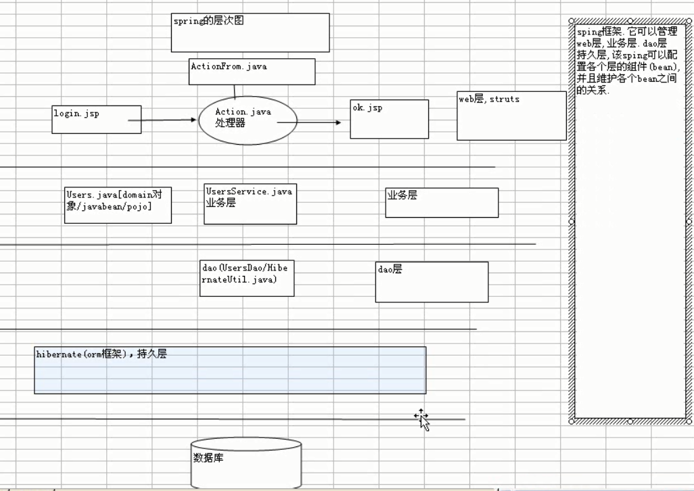
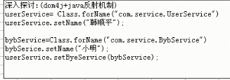
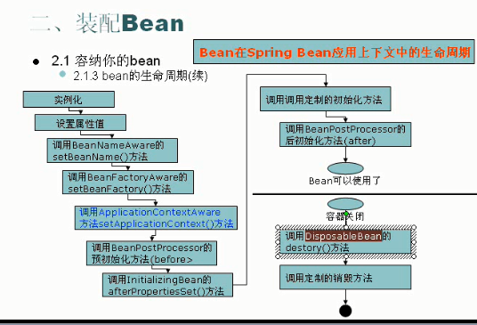
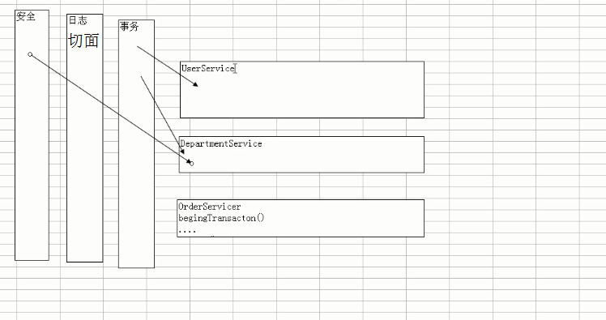
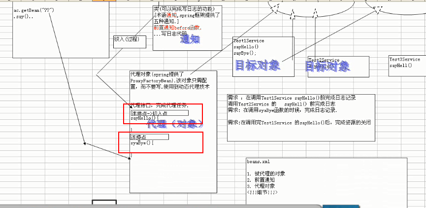

# 一、Spring

## 1. 快速入门案例

### 1.1spring是什么

structs是web框架
hibernate是orm（**Object Relational Mapping对象关系映射**）框架，处于持久层
spring是容器框架，用于配置bean
​				并维护bean之间的关系
spring中bean的概念：bean（java中的任何一个对象 javabean/service/action/数据源/dao，ioc（控制反转inverce of control） di（dependency injection依赖注入）


## 2.配置

2.1 引入spring的开发包（配置spring.jar）和日志包common-loggin.jar/pom.xml中加入依赖

```xml
<dependency>
        <groupId>org.springframework</groupId>
        <artifactId>spring-context</artifactId>
        <version>4.2.2.RELEASE</version>
    </dependency>
```

spring的开发包本身已经依赖了common-logging的jar包，

如果想要把日志开发包改成log4j

可以看这个地址：http://blog.csdn.net/qbg19881206/article/details/19705681


```xml
<?xml version="1.0" encoding="UTF-8"?>    
<beans xmlns="http://www.springframework.org/schema/beans"    
    xmlns:xsi="http://www.w3.org/2001/XMLSchema-instance"   
    xmlns:p="http://www.springframework.org/schema/p"  
    xmlns:aop="http://www.springframework.org/schema/aop"   
    xmlns:context="http://www.springframework.org/schema/context"  
    xmlns:jee="http://www.springframework.org/schema/jee"  
    xmlns:tx="http://www.springframework.org/schema/tx"  
    xsi:schemaLocation="    
        http://www.springframework.org/schema/aop http://www.springframework.org/schema/aop/spring-aop-4.0.xsd  
        http://www.springframework.org/schema/beans http://www.springframework.org/schema/beans/spring-beans-4.0.xsd  
        http://www.springframework.org/schema/context http://www.springframework.org/schema/context/spring-context-4.0.xsd  
        http://www.springframework.org/schema/jee http://www.springframework.org/schema/jee/spring-jee-4.0.xsd  
        http://www.springframework.org/schema/tx http://www.springframework.org/schema/tx/spring-tx-4.0.xsd">    
        
        <!-- 
        spring 框架加载的时候，spring就会自动创建一个bean对象
        UserService userService = new UserService();
        userService.setName("罗佳燕");
        体现注入的概念：注入属性的值
         -->
        <bean id="userService" class="com.topview.spring.UserService">
        	<property name="name">
        		<value>罗佳燕</value>
        	</property>
        </bean>
        
        </beans>
```

## 3. spring底层原理：

spring中applicationContext.xml所配置的相当于一个容器框架：application

底层类似于一个HashMap，配置一个bean相当于一次put的操作，通过getBean可以得到该bean的对象调用bean的方法



## 4. 控制反转和依赖注入

ioc inverse of control控制反转 ：就是将创建对象、维护对象（bean）的关系 
的权利从程序中转移到spring的容器（applicationContext.xml）,程序本身不再维护

di dependency injection依赖注入：di和ioc是同一个概念，spring设计者认为di更
能表示spring核心（ref即使一种对另外一个对象的依赖）

编程粒度：从小到大
汇编------>指令------>c语句------->java对象------->spring切面编程

小结：

web : structs充当web接管jsp/action/表单主要表现出mvc的数据输入、数据的处理、数据的显示分离

model :  service+dao+持久层

## 5.理解IOC、AOP

接口编程，配合di技术可以实现层与层之间的解耦

### 5.1 用demo解释接口编程

- 创建接口

- 两个类实现接口

- 对象配置到spring容器

- 使用

  接口：ChangeLetter

  ```java
  public interface ChangeLetter {
  	public String change();
  	
  }
  ```

  实现类：UpperLetter

  ```java
  public class UpperLetter implements ChangeLetter {
  	private String str;
  	public String getStr() {
  		return str;
  	}
  	public void setStr(String str) {
  		this.str = str;
  	}
  	@Override
  	public String change() {
  		return str.toUpperCase();
  	}
  }
  ```

  配置到容器：

  ```xml
  <bean id="changeLette" class="com.topview.spring.UpperLetter">
          	<property name="str">
          		<value>sljd</value>
          	</property>
          </bean>
  ```

  ​

```java
public static void main( String[] args )
    {
    	ApplicationContext ac = new ClassPathXmlApplicationContext("bean1.xml");
    	ChangeLetter change1 = ac.getBean(ChangeLetter.class);//行1
    	UpperLetter change2 = ac.getBean(UpperLetter.class);//行2
    	UpperLetter change3 = (UpperLetter) ac.getBean("changeLette");//行3
    	ChangeLetter change4 = (ChangeLetter) ac.getBean("changeLette");//行4
    	System.out.println(change2.change());
        System.out.println( change1.change());
        System.out.println(change3.change());
        System.out.println(change4.change());
    }
```


结果：

SLJD
SLJD
SLJD
SLJD

### 5.2.结论

 - 在容器中配置的bean，会创建一个对象，对象类型由class的值决定；
 - 测试代码中，我们可以给getBean()传入接口或实现类，也可以传入bean的id值，最后都能得到在容器中配置好的实现类。

# 二、装配Bean

## 1.1.两种获取Bean的方式

#### 1. ApplicationContext应用上下文容器中获取Bean对象（常用）

```java
ApplicationContext ac = new ClassPathXmlApplicationContext("bean1.xml");
```

当我们实例化bean1.xml文件的时候，该文件中配置的**单例**bean被实例化

#### 2. BeanFactory获取Bean对象（移动开发）

```java
BeanFactory factory = new XmlBeanFactory(new ClassPathResource("bean2.xml") );
    	factory.getBean(Student.class);
```

spring只有在执行getBean语句时候需要的Bean才会被实例化

## 1.2.Bean的作用域

Bean的作用域： 

- singleton整个过程只有一个单例

- prototype(原型：每次获得的时候都是一个新的bean对象)
  ​

- request

- session

- globalSession（全局session）
  这三个是web开发中

  request类似singleton
  globalSession类似prototype

**默认是单例模式singleton**

## 1.3.三种获取ApplicationContext的方法

```java
ApplicationContext ac = new ClassPathXmlApplicationContext("bean1.xml");

ApplicationContext ac2 = new FileSystemXmlApplicationContext("D://chrome/bean2.xml");
//tomcat启动的时候
ApplicationContext  = new XmlWebApplicationContext();
    	
```

## 2.1.基本装配

### 2.1.1.集合注入（数组，List，Set，Map，Properties）

上下文定义文件的根元素：<beans>

子元素：<bean>

​	基本配置：

+ id

+ class

+ `**`scope(默认是singleton)（使用原型bean会对性能产生影响，尽量使用singleton）

+ init-method也可以用注解@PostContruct

+ destroy-method 也可以用注解@Predestroy

+ `**`内置属性

   - 给数组型设置值
   - 给List型设置值
   - 给Set型设置值
   - 给Map设置值
   - 给Properties设置值

  ##### 配置bean的属性值

  ```xml
<bean id="department" class="com.topview.collection.Department">
  <property name="name">
    <value>财务部</value>	
  </property>
  <property name="empName">
    <!--Set型：对象不能一样，若该bean的scope是prototype就可以直接配入同一个配置的bean-->
    <list>
      <ref bean="empl2"/>
      <ref bean="empl1"/>
    </list>
  </property>
  <property name="empl">
    <!--List型：对象可以一样-->
    <list>
      <ref bean="empl1"/>
      <ref bean="empl1"/>
      <ref bean="empl2"/>
    </list>
  </property>
  <!--Map型:key是唯一标识符，不能一样-->
  <property name="emplMap">
    <map>
      <entry key="1"  value-ref="empl1"></entry>
      <entry key="2" value-ref="empl2"></entry>
      <entry key="2" value-ref="empl1"></entry>

    </map>
  </property>
</bean>
<bean id="empl1" class="com.topview.collection.Employee" >
  <property name="name" value="北京"></property>
</bean >
<bean id="empl2" class="com.topview.collection.Employee"> 
  <property name="name" value="汕头"></property>
</bean>、
<bean>
  <property name="pp">
    <props>
      <prop key="pp1">abcd</prop>
      <prop key="pp2">hello</prop>
    </props>
  </property>
</bean>
  ```

  ##### 获取bean的属性值

  ```java
//List-----------------------------------------------------------
for( Employee empName : dp.getEmpName())
{
  System.out.println(empName);
}
//Set-------------------------------------------------------------
for(Employee e : dp.getEmpl())
{
  System.out.println(e);
  System.out.println(e.getName());
}
//Map--------------------------------------------------------------
//1.迭代器
System.out.println("Map");
Map<String,Employee> empMap = dp.getEmplMap();
Iterator	it = dp.getEmplMap().keySet().iterator();
while(it.hasNext()){
  String key  = (String) it.next();
  Employee emp = empMap.get(key);
  System.out.println(emp);
}
//2.entry简洁方法
/*	for(Entry<String, Employee> entry: dp.getEmplMap())
  		{
  			System.out.println("key" + entry.getKey() + "value" + entry.getValue());
  		}*/
//Properties-----------------------------------------------------
for(Entry<Object, Object> entry: pp.entrySet())
{
  System.out.println("Entry" + entry.getKey().toString() + " " 				+entry.getValue().toString());
}

  System.out.println("Enumeration得到属性集合的值");
  Enumeration en = pp.keys();
  while(en.hasMoreElements()){
  /*Entry<Object,Object> entry = (Entry<Object, Object>) 		   en.nextElement();
     System.out.println(entry.getKey() + " " + entry.getValue() );*/
    String key = (String) en.nextElement();
    System.out.println(key + pp.getProperty(key));
}
  ```

### 2.1.2.内部bean

  ```xml
<bean id="department" class="com.topview.collection.Department">
  <property name="name">
    <value>财务部</value>	
  </property>
  <property name="empName">
    <!--内部bean-->
    <bean class="...Bar"></bean>
  </property>
</bean>
  ```

  缺点：复用性不高

## 2.2.继承装配

   父类无需配置特殊的属性

  子类需要配置**parent**

  子类可以重复给属性赋值以**覆盖**父类的给属性赋的值

  ```xml
<bean id="student" class="...Student">
  <property name="name">
    <value>学生</value>
  </property>
</bean>
<bean id="graduate" class="....Graduate" parent="student">
  <property name="name">
    <value>毕业生</value>
  </property>
</bean>
  ```

## 2.3.自动装配（不推荐使用）

装配顺序：首先会查找自己的bean里面是否有内置赋值，若没有才会自动装配

bean的autoWire

#### no

set***方法

#### byName

barBean的id值是fooBean的属性名的时候，自动匹配

#### byType

barBean的类型是fooBean的属性的类型，自动匹配,若是barBean类型的有装配多个则会报错

#### constructor

查找和bean的构造参数一致的一个或多个bean，若找不到或找到多个，抛异常

创建fooBean的时候，会试图-------->byType按照参数类型装配

数据结果是set**和byType的结果

#### autodetect

自动装配constructor和byType二选一

#### default

由beans里面的default-autowire=""决定，而default-autowire默认是no

## ps:激活注解

`<context:annotiation-config>`

注解激活  

## 2.4.配置特殊的bean

### 2.4.1.实现了BeanPostProcessor等的实现类(同平时的bean配置)

### 2.4.2.分散配置

1. 在src/resource中添加文件db.properties

   ```properties
   db.name=root
   db.drivername=com.mysql.Driver
   db.url=jerxluo@yahoo.com
   db.pwd=123456
   ```

2. 在bean中引入文件(location是路径结构相对**容器**的相对路径

   ```xml
   <context:property-placeholder location="classpath:com/topview/collection/db.properties"/>
   ```

3. 使用db.properties文件中的属性值

   ```xml
   <bean id="dbUtil" class="com.topview.util.DbUtil">
     <property name="name" value="${db.name}"></property>
     <property name="drivername" value="${db.drivername}"></property>
     <property name="url" value="${db.url}"></property>
     <property name="pwd" value="${db.pwd}"></property>
   </bean>
   ```

# `重要`三、bean的生命周期



### `*`1.实例化（前提:空构造方法存在）

   	当程序加载bean.xml文件时，单例bean会被实例化可以在bean						
   	的构造方法中执行输出文字，观察ApplicationContext被实例化						      的时候这段文字是否输出

## `*`2.设置属性值（前提:set**存在）

3.实现接口：BeanNameAware   方法 ： setBeanName
4.实现接口：BeanFactory     方法 ： setBeanFactory
5.实现接口：ApplicationContext 方法 ：setApplicationContext

## `*`6.配置关联处理器

BeanPostProcessor实现类 其方法：postProcessBeforeInitialization

```xml
<bean id="myPostProcessor" class="com.topview.spring.MyPostProcessor"/>
```
7.实现接口：InitializingBean  方法 ： AfterPropertiesSet
8.定制后置处理方法： 在bean标签上添加init-method，并在该bean写对应方法

## `*`9.配置关联处理器

BeanPostProcessor实现类 其方法：postProcessAfterInitialization

## `*`10.使用bean

## `*`11.关闭容器

12.实现接口DisposableBean接口  方法：destroy
13.定制销毁方法：  在bean标签上添加destroy-method 并在该bean写对应方法
**1实例化-->2设置属性值-->6配置关联处理器-->10使用bean--->9关联处理器的/*after/*方法---->11关闭容器**

**注意：**以上是bean在应用上下文的周期，而bean在bean工厂里面没有5（ApplicationContext）、6（关联处理器）、9（关联处理器）这个三个阶段

# `重要`四、AOP编程原理剖析

### 1.程序开发过程中遇到的思想

aspect oriented programing(面向切面编程)，是对所有对象或者是一类对象编程

- 核心：不增加代码的基础上，增加新功能
   - 汇编（伪机器指令）面向机器
  - c语言（面向过程）---->系统软件（操作系统、数据库、杀毒软件、防火墙）
  - c++保留面向过程又添加了一定的面向对象的思想
  - java（面向对象）--->类-对象
  - spring（面向切面）让很多项目加入通用的功能（即切面）
    
    
    aop:实际上在开发框架本身用得多，在实际项目中用的不多，但是以后会更多

### 2. aop编程术语+原理图

#### 2.1. 通知

- 环绕通知:MethodInterceptor

  ```java
  public class MyMethodInterceptor implements MethodInterceptor {

    @Override
    public Object invoke(MethodInvocation invocation) throws Throwable {
      System.out.println("~~~~~~~~~~~~~~~~~~~~~~~~~~~~~~~~~环绕通知");
      invocation.proceed();
      System.out.println("~~~~~~~~~~~~~~~~~~~~~~~~~~~~~~~~~环绕通知");
      return null;
    }
  }
  ```

  ​

-  后置通知:AfterReturningAdvice

  ```java
  public class MyAfterReturningAdvice implements AfterReturningAdvice {

    @Override
    public void afterReturning(Object returnValue, Method method, Object[] args, Object target) throws Throwable {
      //returnValue: 目标对象的指定方法执行完毕的返回值
      //method的各种信息
      //target是指目标对象
      System.out.println("------------------------------后置通知");
      System.out.println("returnValue" + returnValue);
      System.out.println("method " + method);
      System.out.println("target " + target);
      System.out.println("------------------------------后置通知");
    }
  }
  ```

  ​

-  前置通知:MethodBeforeAdvice

  ```java
  public class MyMethodBeforeAdvice implements MethodBeforeAdvice {
  	//method:被调用方法名字
  	//args:给method传入的参数
  	//target：被代理对象
  	@Override
  	public void before(Method method, Object[] args, Object target) throws Throwable {
  		
  		System.out.println("========================================前置通知");		
  	}
  }
  ```

  ​

- 异常通知:ThrowsAdvice

  ```java
  public class MyThrowsAdvice implements ThrowsAdvice {
  	public void afterThrowing(Method m, Object[] os, Object target, Exception e){
  		System.out.println("出事了？？？");
  		System.out.println(m);
  		System.out.println(os);
  		System.out.println(target);
  		System.out.println(e);
  		System.out.println("出事了？？？");
  	}
  }
  ```

  ​

- 引入通知

  ```xml
  <bean id="myMethodBeforeAdviceFilter"
    class="org.springframework.aop.support.NameMatchMethodPointcutAdvisor">
      <property name="advice" ref="myMethodBeforeAdvice">
      </property>
      <property name="mappedNames">
      <list>
      <!-- 自定义要切入的方法 -->
      <value>sayBye</value>
      </list>	
      </property>
      </bean>
      <bean id="proxyFactoryBean" class="org.springframework.aop.framework.ProxyFactoryBean">

        <!-- 3.1.代理接口 集 --> 
        <property name="proxyInterfaces">
        <list>
        <value>com.topview.aop.TestServiceInter</value>
        <value>com.topview.aop.TestServiceInter2</value>
        </list>
        </property>    
        <!-- 3.2.将通知织入代理对象 -->
        <property name="interceptorNames" >
        <!-- 只要写id -->
        <list>
        <!-- 使用自定义切入点来控制前置通知 -->
        <value>myMethodBeforeAdviceFilter</value>
        <value>myThrowsAdvice</value>
        <value>myMethodInterceptor</value>

        <value>myAfterReturningAdvice</value>
        </list>
  ```

  ​

#### 2.2.代理对象

​	配置bean.xml ==============被代理的对象、

​								通知（实现接口的实现类）、

​								代理对象

​	2.2.1代理对象ProxyFactoryBean

#### 2.3.aop Demo解析

##### 2.3.1.bean.xml配置

 - 被代理对象:Test1Service（实现了TestServiceInter）
- 前置通知:MyMethodBeforeAdvice
- 代理对象:ProxyFactoryBean

```xml
<!-- 1.配置被代理的对象 -->
<bean id="test1Service" class="com.topview.aop.Test1Service">
  <property name="name" value="luojiayan"></property>
</bean>
<!-- 2.配置前置通知 -->
<bean id="MyMethodBeforeAdvice" class="com.topview.aop.MyMethodBeforeAdvice"/>

<!-- 3.配置代理对象 -->
<bean id="proxyFactoryBean" class="org.springframework.aop.framework.ProxyFactoryBean">
  <!-- 3.1.代理接口 集 --> 
  <property name="proxyInterfaces">
    <list>
      <value>com.topview.aop.TestServiceInter</value>
      <value>com.topview.aop.TestServiceInter2</value>
    </list>
  </property>    
  <!-- *重要* 3.2.将通知织入代理对象 -->
  <!--细节1.通知的name标签为interceptorNames-->
  <property name="interceptorNames" >
    <!-- 细节2.通知只要写id -->
    <value>MyMethodBeforeAdvice</value>
  </property>
  <!-- 3.3.配置被代理对象 -->
  <!--细节3.被代理对象写ref指向指定id-->
  <property name="target" ref="test1Service">
  </property>
</bean> 
```

### 2.4.术语剖析

切面：要实现的交叉功能（通用的功能如：日志管理，安全）

连接点：静态概念，可以理解为可能成为切入点的点

通知：切面的实际实现类（会实现Advice类接口，然后在需要重写的方法中实现功能）

切入点：动态

引入：

代理对象：

织入：是一个过程，这个过程需要的前提配置：在代理对象中配置通知（上面代码的3.2）
关于连接点和切入点：



### 2.5.补充

```xml
<bean>
	<property name="name" value="spring"></property>
</bean>
```

这里property的属性name的值为name，spring底层会去找setName方法
即一个property的属性name的值为/* 的时候spring底层会去找set /*方法，而不会在乎你是否有私有的/ *成员变量

## 3.spring的动态代理技术

spring 的aop中当你通过代理对象去实现aop的时候，获取的ProxyFactoryBean是什么类型？

答： 返回的是一个代理对象。
如果目标对象实现了接口，则spring使用jdk的动态代理技术完成；若没有 实现接口，则spring使用CJLIB技术

`疑惑`动态代理？？？

