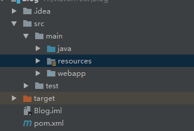
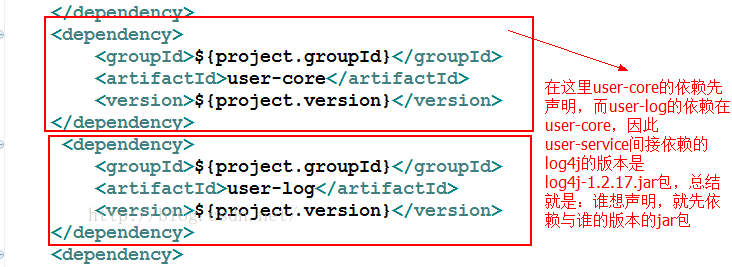
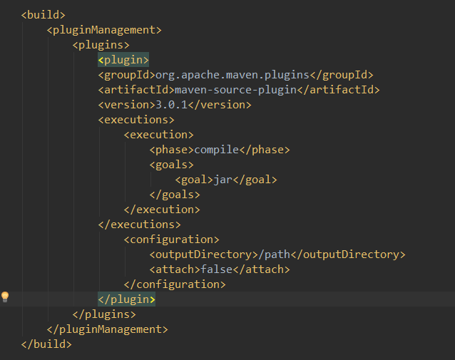
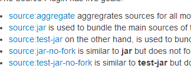
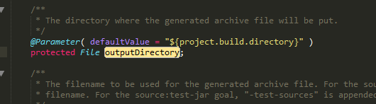

- main，test目录下面要标明java				

- 修改本定仓库位置：`<localRepository>F:/runtime/maven/repository</localRepository>`

- 修改镜像：阿里
  ``` xml 
  <mirrors>
     <mirror>
        <id>alimaven</id>
        <name>aliyun maven</name>
        <url>http://maven.aliyun.com/nexus/content/groups/public/</url>
        <mirrorOf>central</mirrorOf>       
      </mirror>
    </mirrors> 
  ```
- # 巨坑：

 >在setting.xml里记得设置好jdk版本，要不然每一次添加jar包的时候都会默认变回1.5！！
- maven 命令：
  ```maven
  mvn compile //编译
  mvn test   //测试
  mvn clean //清除target
  mvn package //打包，输出到target
  mvn install  // 安装到maven的repository
  mvn dependency:tree  //查看依赖树
  ```


- # maven目录结构：



# pom.xml的简略讲解

## 1.scope

| name     | scope                                  |
| -------- | -------------------------------------- |
| comlipe  | 默认范围，依赖于所有的的classpath，会被打包             |
| provided | 当容器提供了之后才会使用，不会被打包，例如servlet-api       |
| runtime  | 在运行时依赖，编译不依赖，不打包，例如jdbc                |
| test     | 在一般的 编译和运行时都不需要，它们只有在测试编译和测试运行阶段用到，不打包 |
| system   | 指定不开源的jar或者非公开的jar。需要设置路径，不打包          |

# 各个模块之间的依赖
## 1.直接依赖 

moduleA依赖于moduleB：A-->B

A的pom配置：

```xml
        <dependency>
             <groupId>com.project</groupId>
             <artifactId>project.B</artifactId>
             <version>0.0.1-SNAPSHOT</version>
        </dependency>
```

B必须先安装到本地库，否则编译A时会抛异常

B: clean install --> A :clean compile

A会依赖于B所依赖的module或者jar（传递性）

**但是A不会依赖B中的scope为test的jar，B也不会依赖它所以来的module中的scope为test的jar **

## 2.间接接依赖

C添加对A的依赖，同时排除对B的依赖

```xml
    		<dependency>
                <groupId>com.project</groupId>
                <artifactId>project.B</artifactId>
                <version>0.0.1-SNAPSHOT</version>
                <exclusions>
                  <exclusion>
                        <groupId>com.project</groupId>
                        <artifactId>project.A</artifactId>  
                    <!--这里的exclusion里面可以是具体的一个module，也可以是具体的一个jar-->
                  </exclusion>
                </exclusions>
            </dependency>
```

情况1：
**user-core**->**log4j.jar** (version=1.2.17)
**user-log** ->**log4j.jar**(version=1.2.0)
**user-service**->**user-log** && **user-service**->**user-core**
**user-service**会根据谁先写在pom文件的最前面

情况2：
A-->B-->C-->X.jar(version=1.1)
A-->D-->X.jar(version=1.2)
结果就是A——>X.jar(version=1.2)

**总结：最短路径原则和最先申明原则**


#  继承与聚合的关系


**假设目前有四个maven项目，分别是project.parent、project.A、project.B、project.C**

**要求A、B、C整合到一个项目，并且从project.parent继承依赖**

**1、parent聚合A、B、C三个项目**

```xml
<packaging>pom</packaging>
<modules>
<module>project.A</module>
<module>project.B</module>
<module>project.C</module>
</modules>
```

**2、A、B、C分别关联parent项目**

```xml
	<parent>
        <groupId>com.project</groupId>
        <artifactId>project.parent</artifactId>
        <version>0.0.1-SNAPSHOT</version>
    </parent>
```

- 子类会自动继承父类的dependency，父类的dependcyManagement依赖关系只是为了统一版本号，不会被子项目自动继承，除非子项目主动引用。

- 对于聚合模块来说，它知道有哪些被聚合的模块，但那些被聚合的模块不知道这个聚合模块的存在。对于继承关系的父 POM来说，它不知道有哪些子模块继承与它，但那些子模块都必须知道自己的父 POM是什么

# 生命周期

## 1、**clean**

- pre-clean  执行一些需要在clean之前完成的工作
- clean  移除所有上一次构建生成的文件
- post-clean  执行一些需要在clean之后立刻完成的工作

# 2、site

- pre-site     执行一些需要在生成站点文档之前完成的工作
- site    生成项目的站点文档
- post-site     执行一些需要在生成站点文档之后完成的工作，并且为部署做准备
- site-deploy     将生成的站点文档部署到特定的服务器上

这里经常用到的是site阶段和site-deploy阶段，用以生成和发布Maven站点，这可是Maven相当强大的功能，Manager比较喜欢，文档及统计数据自动生成，很好看。

## 3、Default

- validate
- initialize
- generate-sources
- **process-sources: 处理项目主资源文件。一般来说，是对src/main/resources目录的内容进行变量替换等工作后，复制到项目输出的主classpath目录中**
- generate-resources
- process-resources
- **compile: 编译项目的主源码。一般来说，是编译src/main/Java目录下的Java文件至项目输出的主classpath目录中**
- process-classes
- generate-test-sources
- **process-test-sources: 处理项目测试资源文件。一般来说，是对src/test/resources目录的内容进行变量替换等工作后，复制到项目输出的测试classpath目录中**
- generate-test-resources
- process-test-resources
- **test-compile: 编译项目的测试代码，一般来说，是编译src/test/java目录下的Java文件至项目输出的测试classpath目录中**
- process-test-classes
- **test: 使用单元测试框架运行测试，测试代码不会打包或部署**
- prepare-package
- **package: 接受编译好的代码，打包成可发布的格式，如JAR**
- pre-integration-test
- integration-test
- post-integration-test
- verify
- **install: 将包安装到Maven本地仓库，供本地其他Maven项目使用**
- **deploy: 将最终的包复制到远程仓库，供其他开发人员和Maven项目使用**

# 插件

- source:一个用来打包的插件，可以打包java文件：`mvn source:jar`
- 配置如图：
- 
- 具体的架构跟```<dependencyManagement>``` 差不多，```<pluginManagement>```要写在build里面，然后声明```<plugins>```，然后再到具体```<plugin>```，```<plugin>```有gav，其中的```<execution>```(运行)可以用```<phase>```绑定生命周期，用```<goal>``` 绑定目标，其实就是执行的命令（具体目标可以在下载插件的网址可以看到），例如sources的：其实就相当于```mvn source:jar```。
  ,   
  然后到了```<configurartion>``` 这个是配置文件，给插件配置参数，具体能配一些什么要看原本的说明，或者查看源码：

