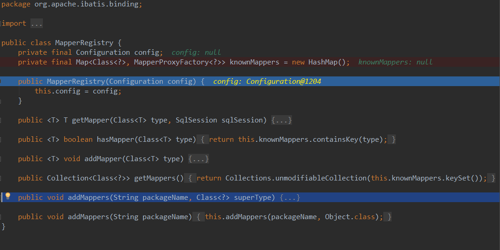
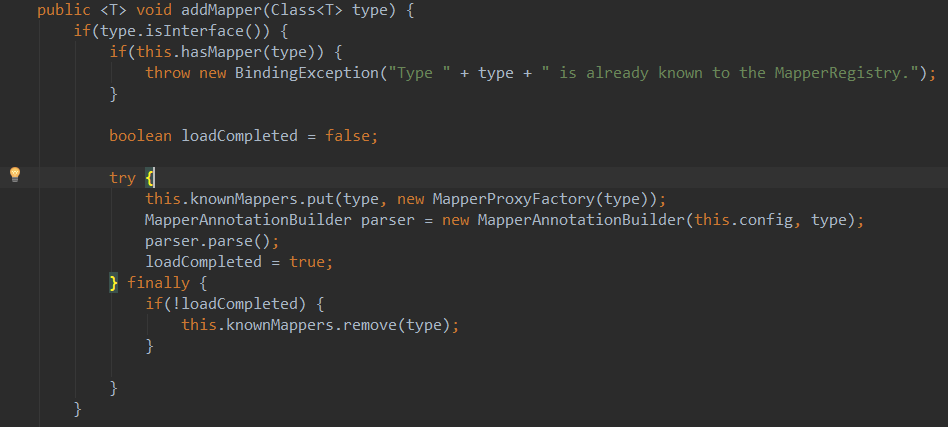
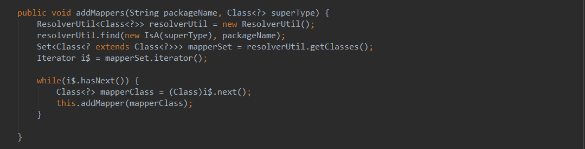

# 一   mybatisConfig.xml

```xml
<?xml version="1.0" encoding="UTF-8" ?>
<!DOCTYPE configuration
  PUBLIC "-//mybatis.org//DTD Config 3.0//EN"
  "http://mybatis.org/dtd/mybatis-3-config.dtd">
<configuration>
  
  <properties resource="db.properties"/>
  
  <typeAliases>  
      <package name="${moduleLocation}"/>     
      <typeAlias alias="User" type="com.pramy.module.User"/>  
      <!--还有一种方法用注解@ -->
  </typeAliases> 
  
    <environments default="development">
        <environment id="development">
            <transactionManager type="JDBC"/>
            <dataSource type="POOLED">
                <property name="driver" value="${jdbc.driverClass}"/>
                <property name="url" value="${jdbc.jdbcUrl}"/>
                <property name="username" value="${jdbc.user}"/>
                <property name="password" value="${jdbc.password}"/>
            </dataSource>
        </environment>
    </environments>
  
  <mappers>
    <mapper class="com.pramy.mapper.UserMapper"/>
    <mapper resource="com/pramy/mapper/UserMapper.xml"/>
    <mapper url="file:///E:/UserMapper.xml"/> 
    <package name="${mapperLocation}"/> 
  </mappers>
</configuration>
```

##    同目录下的db.properties

```xml
jdbc.driverClass=com.mysql.jdbc.Driver
jdbc.jdbcUrl=jdbc:mysql://localhost:3306/test
jdbc.user=root
jdbc.password=root


moduleLocation=com.pramy.module
mapperLocation=com.pramy.mapper
```

**用db.properties的好处就是可以统一路径，修改方便，那么配置文件就可以直接用EL表达式来获取值**


1.```typeAliases```是指定bean别名，如果再这里配置好bean的别名，然后在后面的**BeanMapper.xml**中**ResultType**可以直接填别名。

方法一：可以通过```typeAlias```指明一个bean

方法二：也可以直接指定```package```的名字， mybatis会自动扫描你指定包下面的javabean,  并且默认设置一个别名，默认的名字为： javabean 的首字母小写的非限定类名来作为它的别名

方法三：也可在javabean 加上**注解@Alias** 来自定义别名， 例如： @Alias(user)

2.```environments```一般设置为development，```transactionManager```一般为JDBC

3.```dataSource```的Type设置为POOLED意思是采用连接池，UNPOOLED是不采用

 4.```mapper```设置：

- 第一种class注册是采用全类名 beanMapper.xml的namespace要与接口一一对应
- 第二种resource是采用相对路径指定一个xml
- 第三种url用绝对路径指定xml
- 第四种是指定package路径，扫描改路径下的所有xml，beanMapper.xml的namespace要与接口的路径一一对应

# 二   beanMapper.xml

```xml
<?xml version="1.0" encoding="UTF-8" ?>  
<!DOCTYPE mapper  
  PUBLIC "-//mybatis.org//DTD Mapper 3.0//EN"  
  "http://mybatis.org/dtd/mybatis-3-mapper.dtd">  
   
<mapper namespace="com.mybatis.entity.UserMapper">  
    <insert id="insertUser" parameterType="User" useGeneratedKeys="true" keyColumn="id">  
       insert into t_user(name, age) values(#{name}, #{age})  
    </insert>  
     
    <update id="updateUser" parameterType="User">  
       update t_user set name=#{name}, age=#{age} where id=#{id}  
    </update>  
     
    <select id="findById" parameterType="int" resultType="User">  
       select * from t_user where id=#{id}  
    </select>  
     
    <delete id="deleteUser" parameterType="int">  
       delete from t_user where id=#{id}  
    </delete>  
</mapper> 
```

1.**namespace**是指定该beanMapper.xml的位置

2.```parameterType```指定传入参数的类型，```resultType```是返回值的类型，如果有在conf.xml中指定typeAliases的话，这里就可以用别名，如果没有，就得用**全类名**

3.#{name}是一个占位符

# 三 创建SqlSession

使用了工厂设计模式，最好用静态代码块去加载SqlSessionFactory，用到的Resource是**org.apache.ibatis.io.Resources**

```java
Reader reader = Resources.getResourceAsReader("mybatisConfig.xml");
SessionFactory sessionFactory = new SqlSessionFactoryBuilder().build(reader);
SqlSession sqlSession = sessionFactory.openSession();
//这默认是手动提交 后面要sqlSession.commit才提交数据，设置为true就会自动提交
```


获得SqlSeesion**(以后要细看源码实现方式)**

然后通过反射来加载和绑定beanMapper

```java
 UserMapper userMapper = session.getMapper(UserMapper.class);
        userMapper.insert(user);
```

其中UserMapper是一个interface，绑定了userMapper.xml**（问题：实现原理。实现过程）**

# 四 总结SqlSession和mybatisConfig.xml和beanMapper.xml关系。

- 有两种方法实现mybatis的sql工作	

  - 第一种：

    ```java
    sqlSession.selectOne("com.pramy.UserMapper.selectByPrimaryKey",1)
    ```

    ​通过namespace加id找到xml中的方法来实现。

  - 第二种：

    ```java
    UserMapper userMapper = sqlSession.getMapper(UserMapper.class);
    userMapper.selectByPrimaryKey(1);
    ```

    通过反射来实现。

- mybatisConfig.xml中的**Mapper**是先通过找到xml的位置,通过namespace来查找对应路径下的接口


# 五  加载方式浅谈

1.  在mybatis的源码中有一个MapperRegistry(**映射器注册器**)

  

  源码中有一段

  ```java
  private final Map<Class<?>, MapperProxyFactory<?>> knownMappers = new HashMap<Class<?>, MapperProxyFactory<?>>();
  ```

  **knownMappers**中类型和动态工场一一对应，MapperProxyFactory是映射器代理工厂，通过这个工厂类可以获取到对应的映射器代理类MapperProxy，这里只需要保存一个映射器的代理工厂，根据工厂就可以获取到对应的映射器。

### 添加添加映射器有三个方法

**1.addMapper:添加**



源码中会捕获从xml扫描过来的注册器，规定只有接口类型的class才会被添加，如果这个注册器重复了，会报错。

然后

```java
this.knownMappers.put(type, new MapperProxyFactory(type));
```

将会以type的类型创建一个动态代理工厂，与注册器一起放到 knownMappers中


**2.addMappers(String packageName, Class<?> superType) :查找包下所有是superType的类**



**3 .addMappers(String packageName):查找包下的所有类**


可以看出3调用2，2调用1,所以方法1才是最核心的东西

然而方法3中带了一个参数object.class 调用2，得到的结果就是该包下的所有类都可以添加，因为所有的类都是object的子类，所以在方法2中针对每一个类继续调用方法1。确认是接口类并且没有重发之后就会添加到注册器中；一开始给定一个标志**loadCompleted**一开始没有加载完成所以默认为false，如果添加完成后就把它置为true；如果失败了，就会在finally里面从**knownMappers**中删除

## 回顾一下mybatisConfig.xml中的Mapper中的几个标签：

- resource 和url 都是指定beanMapper.xml，那我如何去获取type？其实就是从beanMapper.xml中的namespace去获得一个简单的class（过程尚未明确，有时间再去了解）
- 而class 就是指定type，所以就会调用第方法2去添加
- package就是调用方法3

  SqlSessionFactoryBean实际上对应的是SqlSessionFactory类，它会扫描sql xml文件，并对接口创建动态代理，将接口类的Class和动态代理关系保存在SqlSessionFactory中，这仅仅是完成了动态代理的生成，而动态代理在哪里被使用到，怎么使用，这些都是由MapperScannerConfigurer完成，接下来看看MapperScannerConfigurer都做了些什么？

4 在**MapperRegistry**映射器注册器中有一个**getMapper()**方法


从集合中获取指定接口类型的映射器代理工厂，然后使用这个代理工厂创建映射器代理实例并返回，那么我们就可以获取到映射器的代理实例


5  MapperProxyFactory


//用JDK自带的动态代理生成映射器,用类加载器去new一个实体类

```java
  protected T newInstance(MapperProxy<T> mapperProxy) {
    return (T) Proxy.newProxyInstance(mapperInterface.getClassLoader(), new Class[] { mapperInterface }, mapperProxy);
  }
```

在这个代理工厂中定义了一个缓存集合，其实为了调用MapperProxy的构造器而设，这个缓存集合用于保存当前映射器中的映射方法的。

映射方法单独定义，是因为这里并不存在一个真正的类和方法供调用，只是通过反射和代理的原理来实现的假的调用，映射方法是调用的最小单位（独立个体），将映射方法定义之后，它就成为一个实实在在的存在，我们可以将调用过的方法保存到对应的映射器的缓存中，以供下次调用，避免每次调用相同的方法的时候都需要重新进行方法的生成。很明显，方法的生成比较复杂，会消耗一定的时间，将其保存在缓存集合中备用，可以极大的解决这种时耗问题。

明天再写吧······


# 四  CURL