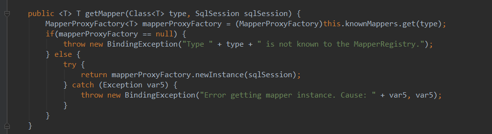
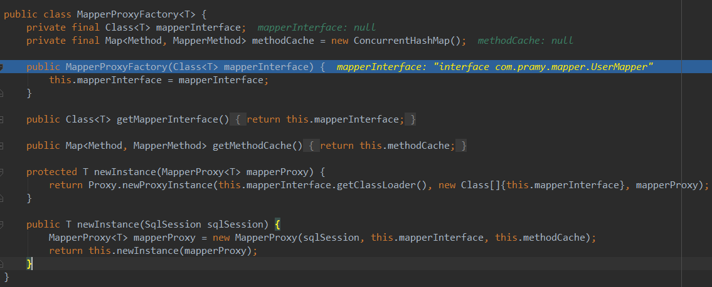

# 一   mybatisConfig.xml

```xml
<?xml version="1.0" encoding="UTF-8" ?>
<!DOCTYPE configuration
  PUBLIC "-//mybatis.org//DTD Config 3.0//EN"
  "http://mybatis.org/dtd/mybatis-3-config.dtd">
<configuration>
  
  <properties resource="db.properties"/>
  
  <typeAliases>  
      <package name="${moduleLocation}"/>     
      <typeAlias alias="User" type="com.pramy.module.User"/>  
      <!--还有一种方法用注解@ -->
  </typeAliases> 
  
    <environments default="development">
        <environment id="development">
            <transactionManager type="JDBC"/>
            <dataSource type="POOLED">
                <property name="driver" value="${jdbc.driverClass}"/>
                <property name="url" value="${jdbc.jdbcUrl}"/>
                <property name="username" value="${jdbc.user}"/>
                <property name="password" value="${jdbc.password}"/>
            </dataSource>
        </environment>
    </environments>
  
  <mappers>
    <mapper class="com.pramy.mapper.UserMapper"/>
    <mapper resource="com/pramy/mapper/UserMapper.xml"/>
    <mapper url="file:///E:/UserMapper.xml"/> 
    <package name="${mapperLocation}"/> 
  </mappers>
</configuration>
```

##    同目录下的db.properties

```xml
jdbc.driverClass=com.mysql.jdbc.Driver
jdbc.jdbcUrl=jdbc:mysql://localhost:3306/test
jdbc.user=root
jdbc.password=root


moduleLocation=com.pramy.module
mapperLocation=com.pramy.mapper
```

**用db.properties的好处就是可以统一路径，修改方便，那么配置文件就可以直接用EL表达式来获取值**


1.```typeAliases```是指定bean别名，如果再这里配置好bean的别名，然后在后面的**BeanMapper.xml**中**ResultType**可以直接填别名。

方法一：可以通过```typeAlias```指明一个bean

方法二：也可以直接指定```package```的名字， mybatis会自动扫描你指定包下面的javabean,  并且默认设置一个别名，默认的名字为： javabean 的首字母小写的非限定类名来作为它的别名

方法三：也可在javabean 加上**注解@Alias** 来自定义别名， 例如： @Alias(user)

2.```environments```一般设置为development，```transactionManager```一般为JDBC

3.```dataSource```的Type设置为POOLED意思是采用连接池，UNPOOLED是不采用

 4.```mapper```设置：

- 第一种class注册是采用全类名 beanMapper.xml的namespace要与接口一一对应
- 第二种resource是采用相对路径指定一个xml
- 第三种url用绝对路径指定xml
- 第四种是指定package路径，扫描改路径下的所有xml，beanMapper.xml的namespace要与接口的路径一一对应

# 二   beanMapper.xml

```xml
<?xml version="1.0" encoding="UTF-8" ?>  
<!DOCTYPE mapper  
  PUBLIC "-//mybatis.org//DTD Mapper 3.0//EN"  
  "http://mybatis.org/dtd/mybatis-3-mapper.dtd">  
   
<mapper namespace="com.mybatis.entity.UserMapper">  
    <insert id="insertUser" parameterType="User" useGeneratedKeys="true" keyColumn="id">  
       insert into t_user(name, age) values(#{name}, #{age})  
    </insert>  
     
    <update id="updateUser" parameterType="User">  
       update t_user set name=#{name}, age=#{age} where id=#{id}  
    </update>  
     
    <select id="findById" parameterType="int" resultType="User">  
       select * from t_user where id=#{id}  
    </select>  
     
    <delete id="deleteUser" parameterType="int">  
       delete from t_user where id=#{id}  
    </delete>  
</mapper> 
```

1.**namespace**是指定该beanMapper.xml的位置

2.```parameterType```指定传入参数的类型，```resultType```是返回值的类型，如果有在conf.xml中指定typeAliases的话，这里就可以用别名，如果没有，就得用**全类名**

3.#{name}是一个占位符

# 三 创建SqlSession

使用了工厂设计模式，最好用静态代码块去加载SqlSessionFactory，用到的Resource是**org.apache.ibatis.io.Resources**

```java
Reader reader = Resources.getResourceAsReader("mybatisConfig.xml");
SessionFactory sessionFactory = new SqlSessionFactoryBuilder().build(reader);
SqlSession sqlSession = sessionFactory.openSession();
//这默认是手动提交 后面要sqlSession.commit才提交数据，设置为true就会自动提交
```


获得SqlSeesion**(以后要细看源码实现方式)**

然后通过反射来加载和绑定beanMapper

```java
 UserMapper userMapper = session.getMapper(UserMapper.class);
        userMapper.insert(user);
```

其中UserMapper是一个interface，绑定了userMapper.xml**（问题：实现原理。实现过程）**

# 四 总结SqlSession和mybatisConfig.xml和beanMapper.xml关系。

- 有两种方法实现mybatis的sql工作	

  - 第一种：

    ```java
    sqlSession.selectOne("com.pramy.UserMapper.selectByPrimaryKey",1)
    ```

    ​通过namespace加id找到xml中的方法来实现。

  - 第二种：

    ```java
    UserMapper userMapper = sqlSession.getMapper(UserMapper.class);
    userMapper.selectByPrimaryKey(1);
    ```

    通过反射来实现。

- mybatisConfig.xml中的**Mapper**是先通过找到xml的位置,通过namespace来查找对应路径下的接口


# 五  加载方式浅谈


## mybatis会从xml解析一系列参数到configure(org.apache.ibatis.session.configure)对象中.

其中主要来研究一下Mapper的加载方式

### 首先创建工厂的时候会回用到SqlSessionFactory的build方法

```java
public SqlSessionFactory build(Reader reader, String environment, Properties properties) {
    try {
      //这里的parser已经读取到mybatis的配置文件，下面开始讲怎么读
      XMLConfigBuilder parser = new XMLConfigBuilder(reader, environment, properties);
   
      return build(parser.parse());
    } catch (Exception e) {
      throw ExceptionFactory.wrapException("Error building SqlSession.", e);
    } finally {
      ErrorContext.instance().reset();
      try {
        reader.close();
      } catch (IOException e) {
        // Intentionally ignore. Prefer previous error.
      }
    }
  }
```

### XMLMapperBuilder


XMLMapperBuilder里面有几个成员变量：

```java
  private XPathParser parser; //下面会讲到，里面储存着xml信息
  private MapperBuilderAssistant builderAssistant;
  private Map<String, XNode> sqlFragments;
  private String resource;
```

里面有很多构造方法我来看一个上面用到的构造方法

```java
  public XMLConfigBuilder(Reader reader, String environment, Properties props) {
    this(new XPathParser(reader, true, props, new XMLMapperEntityResolver()), environment, props);
  }
```

### XPathParser对象中有几个成员变量

```java
  private Document document;
  private boolean validation;
  private EntityResolver entityResolver;
  private Properties variables;
  private XPath xpath;
```

以Xpath构建node，最后以

```java
Node node =xpath.evaluate(root, document, returnType);
```

构建XNode的方式——它对应的内容是xml里面的内容

```java
  private Node node;
  private String name;
  private String body;
  private Properties attributes;
  private Properties variables;   
  private XPathParser xpathParser;

public XNode(XPathParser xpathParser, Node node, Properties variables) {
    this.xpathParser = xpathParser;
    this.node = node;
    this.name = node.getNodeName(); //获得的就是根节点 
    this.variables = variables;
    this.attributes = parseAttributes(node);
    this.body = parseBody(node);
  }

//根节点的类型和值记住 
  private Properties parseAttributes(Node n) {
    Properties attributes = new Properties();
    NamedNodeMap attributeNodes = n.getAttributes();
    if (attributeNodes != null) {
      for (int i = 0; i < attributeNodes.getLength(); i++) {
        Node attribute = attributeNodes.item(i);
        String value = PropertyParser.parse(attribute.getNodeValue(), variables);
        attributes.put(attribute.getNodeName(), value);
      }
    }
    return attributes;
  }

  private String parseBody(Node node) {
    String data = getBodyData(node);
    if (data == null) {
      NodeList children = node.getChildNodes();
      for (int i = 0; i < children.getLength(); i++) {
        Node child = children.item(i);
        data = getBodyData(child);
        if (data != null) {
          break;
        }
      }
    }
    return data;
  }
```

在构造方法中调用了本身的几个方法去获得name，attributes，body

这个document是通过parse模块来把xml转成document，从而将信息存在在document中，回到XMLMapperBuilder

所有信息存储：configure-->XMLConfigureBuiler-->XPathParser-->document-->xml

然后调用

```java
private void parseConfiguration(XNode root) {
  try {
    Properties settings = settingsAsPropertiess(root.evalNode("settings"));
    //issue #117 read properties first
    propertiesElement(root.evalNode("properties"));
    loadCustomVfs(settings);
    typeAliasesElement(root.evalNode("typeAliases"));
    pluginElement(root.evalNode("plugins"));
    objectFactoryElement(root.evalNode("objectFactory"));
    objectWrapperFactoryElement(root.evalNode("objectWrapperFactory"));
    reflectorFactoryElement(root.evalNode("reflectorFactory"));
    settingsElement(settings);
    // read it after objectFactory and objectWrapperFactory issue #631
    environmentsElement(root.evalNode("environments"));
    databaseIdProviderElement(root.evalNode("databaseIdProvider"));
    typeHandlerElement(root.evalNode("typeHandlers"));
    mapperElement(root.evalNode("mappers")); //这里开始注册beanMapper.xml
  } catch (Exception e) {
    throw new BuilderException("Error parsing SQL Mapper Configuration. Cause: " + e, e);
  }
}
```

### XMLConfigureBuile

构建configure要用到XMLConfigureBuiler对象里面用到一个方法

```java
mapperElement(root.evalNode("mappers"));
```
向下找这个方法

```java
private void mapperElement(XNode parent) throws Exception {
    if (parent != null) {
      for (XNode child : parent.getChildren()) {
        //先用检验是否用package方式来注册
        if ("package".equals(child.getName())) {
          //用（XNode）的方式去找package标签的value
          String mapperPackage = child.getStringAttribute("name");
          configuration.addMappers(mapperPackage);
        } else {
          //用（XNode）的方式去找resource标签的value
          String resource = child.getStringAttribute("resource");
          //用（XNode）的方式去找url标签的value
          String url = child.getStringAttribute("url");
          //用（XNode）的方式去找class标签的value
          String mapperClass = child.getStringAttribute("class");
          //然后再用resource加载，这里用到的是 断位与：&& （&&与&的区别）
          if (resource != null && url == null && mapperClass == null) {
            ErrorContext.instance().resource(resource);
            InputStream inputStream = Resources.getResourceAsStream(resource);
            XMLMapperBuilder mapperParser = new XMLMapperBuilder(inputStream, configuration, resource, configuration.getSqlFragments());
            mapperParser.parse();
            //然后到url
          } else if (resource == null && url != null && mapperClass == null) {
            ErrorContext.instance().resource(url);
            InputStream inputStream = Resources.getUrlAsStream(url);
            XMLMapperBuilder mapperParser = new XMLMapperBuilder(inputStream, configuration, url, configuration.getSqlFragments());
            mapperParser.parse();
          } else if (resource == null && url == null && mapperClass != null) {
            //然后到class
            Class<?> mapperInterface = Resources.classForName(mapperClass);
            configuration.addMapper(mapperInterface);
          } else {
            throw new BuilderException("A mapper element may only specify a url, resource or class, but not more than one.");
          }
        }
      }
    }
  }
```

**加载优先级package>resource>url>class**

可以看出除了package和class是以```configuration.addMapper(mapperInterface)``` 方式来加载Mapper

```java
XMLMapperBuilder mapperParser = new XMLMapperBuilder(inputStream, configuration, url, configuration.getSqlFragments());
//configuration.getSqlFragments()得到的是一个Map<String, XNode>类型
```


### XMLMapperBuilder


#### configure里面的 mapperElement方法构建完XMLMapperBuilder后，执行XMLMapperBuilder的parse()方法，这个方法又调用parser（XPathParser）的evalNode方法

```java
//这个方法是根据：resourcse去加载beanMapper.xml，通过namespace绑定接口


public void parse() {
    if (!configuration.isResourceLoaded(resource)) {
      //parser.evalNode("/mapper")返回来的是一个XNode类,由Node类构建，而Node又以Xpath方式去以根节点（/mapper）+document去构建。
      configurationElement(parser.evalNode("/mapper"));
      configuration.addLoadedResource(resource);
      //绑定的的最开始入口
      bindMapperForNamespace();
    }
	
    parsePendingResultMaps();
    parsePendingChacheRefs();
    parsePendingStatements();
  }
//绑定的方法
  private void bindMapperForNamespace() {
    String namespace = builderAssistant.getCurrentNamespace();
    if (namespace != null) {
      Class<?> boundType = null;
      try {
        boundType = Resources.classForName(namespace);
      } catch (ClassNotFoundException e) {
        //ignore, bound type is not required
      }
      if (boundType != null) {
        if (!configuration.hasMapper(boundType)) {
          // Spring may not know the real resource name so we set a flag
          // to prevent loading again this resource from the mapper interface
          // look at MapperAnnotationBuilder#loadXmlResource
          configuration.addLoadedResource("namespace:" + namespace);
          configuration.addMapper(boundType);
        }
      }
    }
  }
```


构建node

```java
Node node =xpath.evaluate("/mapper", document, returnType);
```


构建XNode的方式——它对应的内容是beanMapper.xml里面的内容

```java
  private Node node;
  private String name;
  private String body;
  private Properties attributes;
  private Properties variables;
  private XPathParser xpathParser;

public XNode(XPathParser xpathParser, Node node, Properties variables) {
    this.xpathParser = xpathParser;
    this.node = node;
    this.name = node.getNodeName(); //获得的就是根节点 /mapper
    this.variables = variables;
    this.attributes = parseAttributes(node);
    this.body = parseBody(node);
  }

//根节点的类型和值记住 
  private Properties parseAttributes(Node n) {
    Properties attributes = new Properties();
    NamedNodeMap attributeNodes = n.getAttributes();
    if (attributeNodes != null) {
      for (int i = 0; i < attributeNodes.getLength(); i++) {
        Node attribute = attributeNodes.item(i);
        String value = PropertyParser.parse(attribute.getNodeValue(), variables);
        attributes.put(attribute.getNodeName(), value);
      }
    }
    return attributes;
  }

  private String parseBody(Node node) {
    String data = getBodyData(node);
    if (data == null) {
      NodeList children = node.getChildNodes();
      for (int i = 0; i < children.getLength(); i++) {
        Node child = children.item(i);
        data = getBodyData(child);
        if (data != null) {
          break;
        }
      }
    }
    return data;
  }
```

在构造方法中调用了本身的几个方法去获得name，attributes，body


总结：通过找到一个XNode（）


### 在mybatis的源码中有一个MapperRegistry(**映射器注册器**)

  ```java

package org.apache.ibatis.binding;

import org.apache.ibatis.builder.annotation.MapperAnnotationBuilder;
import org.apache.ibatis.io.ResolverUtil;
import org.apache.ibatis.session.Configuration;
import org.apache.ibatis.session.SqlSession;

import java.util.Collection;
import java.util.Collections;
import java.util.HashMap;
import java.util.Map;
import java.util.Set;

/**
 * @author Clinton Begin
 * @author Eduardo Macarron
 * @author Lasse Voss
 */
public class MapperRegistry {

  private final Configuration config;
  private final Map<Class<?>, MapperProxyFactory<?>> knownMappers = new HashMap<Class<?>, MapperProxyFactory<?>>();

  public MapperRegistry(Configuration config) {
    this.config = config;
  }

  @SuppressWarnings("unchecked")
  public <T> T getMapper(Class<T> type, SqlSession sqlSession) {
    final MapperProxyFactory<T> mapperProxyFactory = (MapperProxyFactory<T>) knownMappers.get(type);
    if (mapperProxyFactory == null) {
      throw new BindingException("Type " + type + " is not known to the MapperRegistry.");
    }
    try {
      return mapperProxyFactory.newInstance(sqlSession);
    } catch (Exception e) {
      throw new BindingException("Error getting mapper instance. Cause: " + e, e);
    }
  }
  
  public <T> boolean hasMapper(Class<T> type) {
    return knownMappers.containsKey(type);
  }

  public <T> void addMapper(Class<T> type) {
    if (type.isInterface()) {
      if (hasMapper(type)) {
        throw new BindingException("Type " + type + " is already known to the MapperRegistry.");
      }
      boolean loadCompleted = false;
      try {
        knownMappers.put(type, new MapperProxyFactory<T>(type));
        // It's important that the type is added before the parser is run
        // otherwise the binding may automatically be attempted by the
        // mapper parser. If the type is already known, it won't try.
        MapperAnnotationBuilder parser = new MapperAnnotationBuilder(config, type);
        parser.parse();
        loadCompleted = true;
      } finally {
        if (!loadCompleted) {
          knownMappers.remove(type);
        }
      }
    }
  }

  /**
   * @since 3.2.2
   */
  public Collection<Class<?>> getMappers() {
    return Collections.unmodifiableCollection(knownMappers.keySet());
  }

  /**
   * @since 3.2.2
   */
  public void addMappers(String packageName, Class<?> superType) {
    ResolverUtil<Class<?>> resolverUtil = new ResolverUtil<Class<?>>();
    resolverUtil.find(new ResolverUtil.IsA(superType), packageName);
    Set<Class<? extends Class<?>>> mapperSet = resolverUtil.getClasses();
    for (Class<?> mapperClass : mapperSet) {
      addMapper(mapperClass);
    }
  }

  /**
   * @since 3.2.2
   */
  public void addMappers(String packageName) {
    addMappers(packageName, Object.class);
  }
  
}

  ```


  源码中有一段

  ```java
  private final Map<Class<?>, MapperProxyFactory<?>> knownMappers = new HashMap<Class<?>, MapperProxyFactory<?>>();
  ```

  **knownMappers**中类型和动态工场一一对应，MapperProxyFactory是映射器代理工厂，通过这个工厂类可以获取到对应的映射器代理类MapperProxy，这里只需要保存一个映射器的代理工厂，根据工厂就可以获取到对应的映射器。

### 添加添加映射器有三个方法

**1.addMapper:添加**

```java
public <T> void addMapper(Class<T> type) {
    if (type.isInterface()) {
      if (hasMapper(type)) {
        throw new BindingException("Type " + type + " is already known to the MapperRegistry.");
      }
      boolean loadCompleted = false;
      try {
        //创建工厂
        knownMappers.put(type, new MapperProxyFactory<T>(type));
		//根据接口名寻找同包下同名的xml或者mapper的namespace是该接口的xml
        //找到对用的xml后进行解析mapper节点里面的节点
        MapperAnnotationBuilder parser = new MapperAnnotationBuilder(config, type);
        parser.parse();
        loadCompleted = true;
      } finally {
        if (!loadCompleted) {
          knownMappers.remove(type);
        }
      }
    }
  }
```


源码中会捕获从xml扫描过来的注册器，规定只有接口类型的class才会被添加，如果这个注册器重复了，会报错。

然后

```java
this.knownMappers.put(type, new MapperProxyFactory(type));
```

将会以type的类型创建一个动态代理工厂，与注册器一起放到 knownMappers中


**2.addMappers(String packageName, Class<?> superType) :查找包下所有是superType的类**

```java
  public void addMappers(String packageName, Class<?> superType) {
    ResolverUtil<Class<?>> resolverUtil = new ResolverUtil<Class<?>>();
    resolverUtil.find(new ResolverUtil.IsA(superType), packageName);
    Set<Class<? extends Class<?>>> mapperSet = resolverUtil.getClasses();
    for (Class<?> mapperClass : mapperSet) {
      addMapper(mapperClass);
    }
  }
```


**3 .addMappers(String packageName):查找包下的所有类**

```java
  public void addMappers(String packageName) {
    addMappers(packageName, Object.class);
  }
```


可以看出3调用2，2调用1,所以方法1才是最核心的东西

然而方法3中带了一个参数object.class 调用2，得到的结果就是该包下的所有类都可以添加，因为所有的类都是object的子类，所以在方法2中针对每一个类继续调用方法1。确认是接口类并且没有重发之后就会添加到注册器中；一开始给定一个标志**loadCompleted**一开始没有加载完成所以默认为false，如果添加完成后就把它置为true；如果失败了，就会在finally里面从**knownMappers**中删除


## 回顾一下mybatisConfig.xml中的Mapper中的几个标签：

- resource 和url 都是指定beanMapper.xml，那我如何去获取type？其实就是从beanMapper.xml中的namespace去获得一个简单的class（过程尚未明确，有时间再去了解）
- 而class 就是指定type，所以就会调用第方法2去添加
- package就是调用方法3

  SqlSessionFactoryBean实际上对应的是SqlSessionFactory类，它会扫描sql xml文件，并对接口创建动态代理，将接口类的Class和动态代理关系保存在SqlSessionFactory中，这仅仅是完成了动态代理的生成，而动态代理在哪里被使用到，怎么使用，这些都是由MapperScannerConfigurer完成，接下来看看MapperScannerConfigurer都做了些什么？

### 在MapperRegistry映射器注册器中有一个getMapper()方法



从集合中获取指定接口类型的映射器代理工厂，然后使用这个代理工厂创建映射器代理实例并返回，那么我们就可以获取到映射器的代理实例


###   MapperProxyFactory 映射器代理工厂



//用JDK自带的动态代理生成映射器,用类加载器去new一个实体类

```java
  protected T newInstance(MapperProxy<T> mapperProxy) {
    return (T) Proxy.newProxyInstance(mapperInterface.getClassLoader(), new Class[] { mapperInterface }, mapperProxy);
  }
```

在这个代理工厂中定义了一个缓存集合，其实为了调用MapperProxy的构造器而设，这个缓存集合用于保存当前映射器中的映射方法的。

### MapperProxy 映射器代理

```java
package org.apache.ibatis.binding;

import java.io.Serializable;
import java.lang.reflect.InvocationHandler;
import java.lang.reflect.Method;
import java.util.Map;

import org.apache.ibatis.reflection.ExceptionUtil;
import org.apache.ibatis.session.SqlSession;

/**
 * @author Clinton Begin
 * @author Eduardo Macarron
 */
public class MapperProxy<T> implements InvocationHandler, Serializable {

  private static final long serialVersionUID = -6424540398559729838L;
  private final SqlSession sqlSession;
  private final Class<T> mapperInterface;
  private final Map<Method, MapperMethod> methodCache;

  public MapperProxy(SqlSession sqlSession, Class<T> mapperInterface, Map<Method, MapperMethod> methodCache) {
    this.sqlSession = sqlSession;
    this.mapperInterface = mapperInterface;
    this.methodCache = methodCache;
  }

  //代理以后实体类调用什么方法是都是执行invoke方法
  @Override
  public Object invoke(Object proxy, Method method, Object[] args) throws Throwable {
    if (Object.class.equals(method.getDeclaringClass())) {
      try {
        return method.invoke(this, args);
      } catch (Throwable t) {
        throw ExceptionUtil.unwrapThrowable(t);
      }
    }
    final MapperMethod mapperMethod = cachedMapperMethod(method);
    return mapperMethod.execute(sqlSession, args);
  }

  private MapperMethod cachedMapperMethod(Method method) {
    //这是是从methodCache(一个Map，用来做缓存区)找这个方法。如果没有才new出来，提高了效率
    MapperMethod mapperMethod = methodCache.get(method);
    if (mapperMethod == null) {
      mapperMethod = new MapperMethod(mapperInterface, method, sqlSession.getConfiguration());
      methodCache.put(method, mapperMethod);
    }
    return mapperMethod;
  }

}

```

### MapperMethod  方法映射器

（待定）


### typeAliases标签--->TypeAliasRegistry（注册器）

```java
private final Map<String, Class<?>> TYPE_ALIASES = new HashMap<String, Class<?>>();
```

也是通过注册器来实现，有5个方法，前3个方法方法和MapperRegistry大同小异，

有两个方法进行注册

**package：1-->2-->3-->4**

**alis:5-->4**


```java
//1
  public void registerAliases(String packageName){
    registerAliases(packageName, Object.class);
  }
//2
  public void registerAliases(String packageName, Class<?> superType){
    ResolverUtil<Class<?>> resolverUtil = new ResolverUtil<Class<?>>();
    resolverUtil.find(new ResolverUtil.IsA(superType), packageName);
    Set<Class<? extends Class<?>>> typeSet = resolverUtil.getClasses();
    for(Class<?> type : typeSet){
      // Ignore inner classes and interfaces (including package-info.java)
      // Skip also inner classes. See issue #6
      if (!type.isAnonymousClass() && !type.isInterface() && !type.isMemberClass()) {
        registerAlias(type);
      }
    }
  }
//3
  public void registerAlias(Class<?> type) {
    String alias = type.getSimpleName();
    Alias aliasAnnotation = type.getAnnotation(Alias.class);
    if (aliasAnnotation != null) {
      alias = aliasAnnotation.value();
    } 
    registerAlias(alias, type);
  }
//4最核心的方法
  public void registerAlias(String alias, Class<?> value) {
    if (alias == null) {
      throw new TypeException("The parameter alias cannot be null");
    }
    // 这里看到，你在xml所写的别名都会转为小写
    String key = alias.toLowerCase(Locale.ENGLISH);
    if (TYPE_ALIASES.containsKey(key) && TYPE_ALIASES.get(key) != null && !TYPE_ALIASES.get(key).equals(value)) {
      throw new TypeException("The alias '" + alias + "' is already mapped to the value '" + TYPE_ALIASES.get(key).getName() + "'.");
    }
    TYPE_ALIASES.put(key, value);  //此处进行类型注册
  }
//5
  public void registerAlias(String alias, String value) {
    try {
      registerAlias(alias, Resources.classForName(value));
    } catch (ClassNotFoundException e) {
      throw new TypeException("Error registering type alias "+alias+" for "+value+". Cause: " + e, e);
    }
  }
```

这类的构造方法里面调用方法1给我们注册了许多默认的类型，例如int string long。

---


里面还有一个找到class的方法

```java
  public <T> Class<T> resolveAlias(String string) {
    try {
      if (string == null) {
        return null;
      }
      // 全小写
      String key = string.toLowerCase(Locale.ENGLISH);
      Class<T> value;
      //如果注册器（map）中有这个类
      if (TYPE_ALIASES.containsKey(key)) {
        //从注册器中找
        value = (Class<T>) TYPE_ALIASES.get(key);
      } else {
        //如果没有就从 org.apache.ibatis.io.Resources这个类中建造一个
        value = (Class<T>) Resources.classForName(string);
      }
      return value;
    } catch (ClassNotFoundException e) {
      throw new TypeException("Could not resolve type alias '" + string + "'.  Cause: " + e, e);
    }
  }
```

**org.apache.ibatis.io.Resources;**里面的classForName方法

```java
  public static Class<?> classForName(String className) throws ClassNotFoundException {
    //用jdk的加载器去加载这个类
    return classLoaderWrapper.classForName(className);
  }
```


### TypeHandlerReister(类型注册器)

里面有三个成员变量

```java
private final Map<JdbcType, TypeHandler<?>> JDBC_TYPE_HANDLER_MAP = new EnumMap<JdbcType, TypeHandler<?>>(JdbcType.class);

private final Map<Type, Map<JdbcType, TypeHandler<?>>> TYPE_HANDLER_MAP = new HashMap<Type, Map<JdbcType, TypeHandler<?>>>();

private final Map<Class<?>, TypeHandler<?>> ALL_TYPE_HANDLERS_MAP = new HashMap<Class<?>, TypeHandler<?>>();
```

- 第一种**JDBC_TYPE_HANDLER_MAP**：是一种枚举Map，这种Map先天存在key，而key就是数据库类型，用来写入数据库
- 第二种**TYPE_HANDLER_MAP**，是一个嵌套Map，里面的Ma就是第一种，外面的Map的key就是java类型，这就相当于javaType-jdbcType一一对应。
- 第三种**ALL_TYPE_HANDLERS_MAP**，虽然我不是很明白什么意思，不过看名字应该是保存所有的注册器

### TypeReference（用于获取原生类）

```java

package org.apache.ibatis.type;

import java.lang.reflect.ParameterizedType;
import java.lang.reflect.Type;

/**
 * References a generic type.
 *
 * @param <T> the referenced type
 * @since 3.1.0
 * @author Simone Tripodi
 */
public abstract class TypeReference<T> {

  private final Type rawType;

  protected TypeReference() {
    //构造方法中调用，自身的方法,把自己的class传进去
    rawType = getSuperclassTypeParameter(getClass());
  }

  
 //核心方法
  Type getSuperclassTypeParameter(Class<?> clazz) {
    //用自身的class调用getGenericSuperclass()来获取直接带参数的类，即泛型类T
    Type genericSuperclass = clazz.getGenericSuperclass();
    
    /*由于每一个类都是Class类的子类，而Class本身也是一个类，但是它又是所有类的父类,查阅资料的到Class的实例表示的是在一个运行的应用中的所有类和接口，所以Class类的实类就是借口与类。jdk里面规定了，只有泛型不属于Class类（具体我也不清楚）*/
 =========================   
    if (genericSuperclass instanceof Class) {
      
      //如果父类又不是TypeReference就向下递归找到参数类
      if (TypeReference.class != genericSuperclass) {
        return getSuperclassTypeParameter(clazz.getSuperclass());
      }

      //如果是TypeReference，这里TypeException有一个内部的构造方法，把TypeReference类传进去，在里面如果不是TypeReference类型，就没事，继续递归，如果不是就抛异常，说明程序出错了
      throw new TypeException("'" + getClass() + "' extends TypeReference but misses the type parameter. "
        + "Remove the extension or add a type parameter to it.");
    }
===========================
    
    //如果找到泛型类了。就钱转它的子类ParameterizedType，既参数化，然后获取实际的参数，获取泛型的参数类型，可能参数不止一个，所以获取第一个
    
    Type rawType = ((ParameterizedType) genericSuperclass).getActualTypeArguments()[0];
    // TODO remove this when Reflector is fixed to return Types
    if (rawType instanceof ParameterizedType) {
      rawType = ((ParameterizedType) rawType).getRawType();
    }

    return rawType;
  }

  public final Type getRawType() {
    return rawType;
  }

  @Override
  public String toString() {
    return rawType.toString();
  }

}

```

在type下面还有很多类型处理器，不想看了


映射方法单独定义，是因为这里并不存在一个真正的类和方法供调用，只是通过反射和代理的原理来实现的假的调用，映射方法是调用的最小单位（独立个体），将映射方法定义之后，它就成为一个实实在在的存在，我们可以将调用过的方法保存到对应的映射器的缓存中，以供下次调用，避免每次调用相同的方法的时候都需要重新进行方法的生成。很明显，方法的生成比较复杂，会消耗一定的时间，将其保存在缓存集合中备用，可以极大的解决这种时耗问题。

明天再写吧······


# 四  CURL