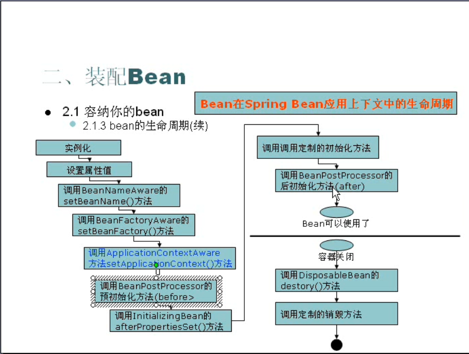
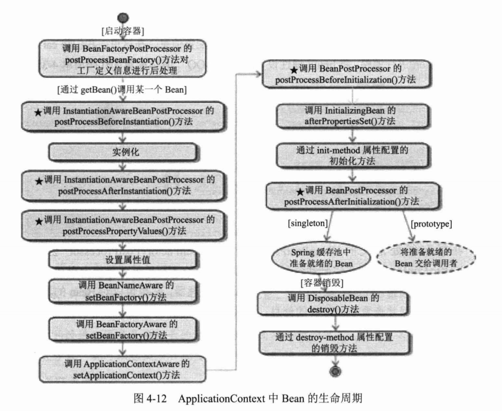
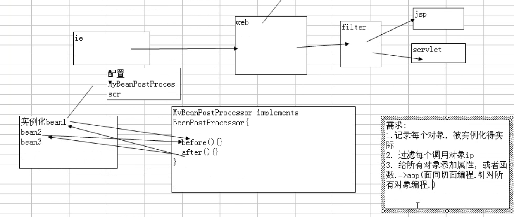
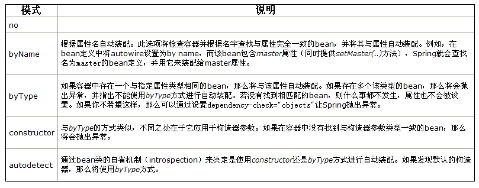
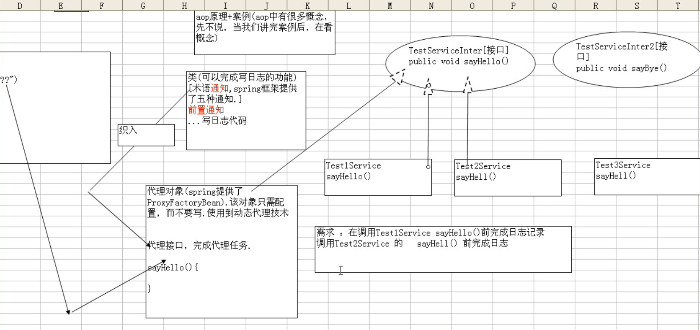
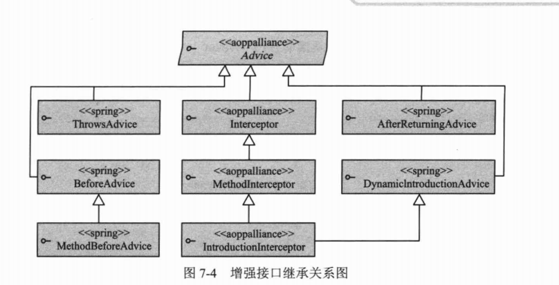
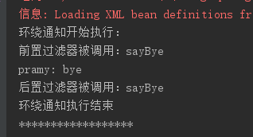
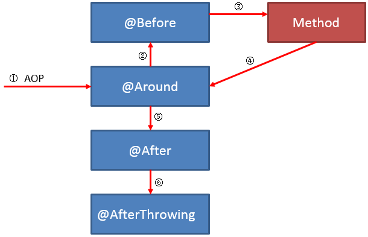
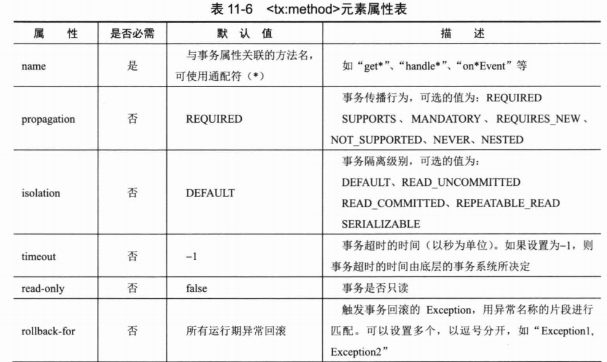

# 一.spring配置文件

```xml
<!--maven依赖-->
        <dependency>
            <groupId>org.springframework</groupId>
            <artifactId>spring-core</artifactId>
            <version>${spring.versin}</version>
        </dependency>
        <dependency>
            <groupId>org.springframework</groupId>
            <artifactId>spring-beans</artifactId>
            <version>${spring.versin}</version>
        </dependency>
        <dependency>
            <groupId>org.springframework</groupId>
            <artifactId>spring-context</artifactId>
            <version>${spring.versin}</version>
        </dependency>
```
通过以下一句话加载框架，并且注入所有的bean
```java
 ApplicationContext applicationContext = new ClassPathXmlApplicationContext("springAction.xml");
```

加载方式：

```xml
    <bean id="boss" class="com.pramy.po.Boss">
        <property name="car" ref="car"/>
        <property name="office" ref="office" />
      <!--依赖注入的一个条件就是boss中一定要有setCar()和setOffice()的方法-->
    </bean>
    <bean id="office" class="com.pramy.po.Office">
        <property name="officeNo" value="002"/>
    </bean>
    <bean id="car" class="com.pramy.po.Car" >
        <property name="brand" value=" 红旗 CA72"/>
        <property name="price" value="2000"/>
    </bean>
<!--boss两个成员变量分别依赖car 和office-->
```

一个bean元素是一个po ,id必须唯一，而且要指定class位置

spring是用反射机制加载类。

### ioc(inverse of controll)

控制翻转：所谓控制反转就是把创建对象和维护对象的关系从程序中转移到spring容器中(applicationContext),而程序本身不再维护了

### DI (denpendency injection) 依赖注入

# 二.注解

[**使用 @Autowired 注释**]()

Spring 2.5 引入了 `@Autowired` 注释，它可以对类成员变量、方法及构造函数进行标注，完成自动装配的工作，

Spring 通过一个 `BeanPostProcessor` 对 `@Autowired` 进行解析，所以要让`@Autowired` 起作用必须事先在 Spring 容器中声明`AutowiredAnnotationBeanPostProcessor` Bean

```xml
 <!--使用@Autowired必须注入这个bean-->
<bean class="org.springframework.beans.factory.annotation.AutowiredAnnotationBeanPostProcessor"/>

    <bean id="boss" class="com.pramy.po.Boss"/>
	<!--这里就可以省略对boss属性的引用-->
    <bean id="office" class="com.pramy.po.Office">
        <property name="officeNo" value="002"/>
    </bean>
    <bean id="car" class="com.pramy.po.Car" >
        <property name="brand" value=" 红旗 CA72"/>
        <property name="price" value="2000"/>
    </bean>
```

使用 `@Autowired` 注释，当 Spring 容器启动时，`AutowiredAnnotationBeanPostProcessor` 将扫描 Spring 容器中所有 Bean，一旦看到有 `@Autowired`的注释就会在容器中需找bean匹配，Spring使用的是**反射 **方式赋值，所以在Boss类中可以不需要set方法。

一旦使用了改标签，就必须要求在容器中找到该bean，否则会报BeanCreationException，但是可以通过**@Autowired(required = false)** 来取消报错

[**使用@Qualifier注释指定注入Bean名称**]()

```xml
<bean id="office" class="com.pramy.po.Office">
    <property name="officeNo" value="001"/>
</bean>
<bean id="office2" class="com.parmy.po.Office">
    <property name="officeNo" value="001"/>
</bean>
```

当配置文件中有两个一样类型的bean，用`@Autowired`会出错，所以可以用`@Qualifier` 来指定id注入

```java
             
@Autowired
public void setOffice(@Qualifier("office")Office office) {
    this.office = office;
}
```

[**使用 context:annotation-config 简化配置**]()

在开头可以加入

```xml
<beans xmlns="http://www.springframework.org/schema/beans"
    xmlns:xsi="http://www.w3.org/2001/XMLSchema-instance"
     xmlns:context="http://www.springframework.org/schema/context"
     xsi:schemaLocation="http://www.springframework.org/schema/beans 
 http://www.springframework.org/schema/beans/spring-beans-2.5.xsd
 http://www.springframework.org/schema/context 
 http://www.springframework.org/schema/context/spring-context-2.5.xsd">
 <!--必须在上面加入xsd-->
    <context:annotation-config/>
```

Spring 2.1 添加了一个新的 context 的 Schema 命名空间，该命名空间对注释驱动、属性文件引入、加载期织入等功能提供了便捷的配置。我们知道注释本身是不会做任何事情的，它仅提供元数据信息。要使元数据信息真正起作用，必须让负责处理这些元数据的处理器工作起来

[**使用 @Component和@scopee**]()

Spring 2.5 在 @Repository 的基础上增加了功能类似的额外三个注解：@Component、@Service、@Constroller，它们分别用于软件系统的不同层次：

- @Component 是一个泛化的概念，仅仅表示一个组件 (Bean) ，可以作用在任何层次。
- @Service 通常作用在业务层，但是目前该功能与 @Component 相同。
- @Constroller 通常作用在控制层，但是目前该功能与 @Component 相同。
- @Repository 标识为dao

通过在类上使用 @Repository、@Component、@Service 和 @Constroller 注解，Spring 会自动创建相应的 BeanDefinition 对象，并注册到 ApplicationContext 中。这些类就成了 Spring 受管组件。这三个注解除了作用于不同软件层次的类，其使用方式与 @Repository 是完全相同的

需要在xml中加入扫面器

```xml
<context:component-scan base-package="com.pramy.po"/>
<!--扫描该包下的所有bean-->
```

然后在在类的上面加上标签

```java
@Scope("prototype") //绑定生命周期
@Component //自动被扫面器扫描到，然后注入
public class Boss {
    @Autowired
    private Car car;
    @Autowired
    private Office office;

}
```

# 三 接口的好处

```java
interface A
class B implements A, class C implements A
```

B 和C 需要实现A接口的方法；根据需要可以在B,C的实现方法中写不同的逻辑

在xml中正常配置，记住，在配置文件中的class必须是实实在在的class。接口不行

```xml
<bean id="id" class="com.pramy.po.B"/>
<!--两个二选-->
<bean id="id" class="com.pramy.po.C"/>
```

```java
 ApplicationContext ctx =new ClassPathXmlApplicationContext(locations);
 A a = (A)ctx.getBean("id");//强转接口
a.action
 //这样子就可以通过在xml配置可以让接口A去实现B类的逻辑方法，或者C类的逻辑方法，达到降低耦合度的效果
```

# 四 生命周期socpe



**ApplicationContext和BeanFactory不同之处就是，前者可以通过Java反射机制自动识别出配置文件中定义的各种处理器，并且将他们注册到应用上下文中，而后者需要手动调addBeanPostProcessor() **

[**BeanPostProcessor**]()

后置处理器，类似于web 中的filter

可以绑定bean，在xml中配置

首先创建一个bean 实现BeanPostProcessor接口，然后破实现其中的方法

```java
public class MyBeanPostProcessor implements BeanPostProcessor {
    @Override
    public Object postProcessBeforeInitialization(Object o, String s) throws BeansException {
        return o;
    }

    @Override
    public Object postProcessAfterInitialization(Object o, String s) throws BeansException {
        return o;
    }
}
```

然后再在xml中加载你这个bean

```xml
 <bean id="myBeanPostProcessor" class="com.pramy.po.MyBeanPostProcessor"/>
```




在每一次实现bean的是偶都会实现before()方法然后实现after()方法后再去调用bean

[**InstantiationAwareBeanPostProcessor**]()

这是一个接口,但是继承了**BeanPostProcessor **接口，调用getBean的时候，如果容器实现了这个接口，则在该bean之前，调用以下这个方法
```java
public Object postProcessBeforeInstantiation(Class beanClass, String beanName)
```

实例化：当spring框架启动的时候，解析完配置文件的时候，就会把scope=singleton的bean加载到内存区。

首先调用无参构造器（默认）new出一个实例。

如果实现了这个接口，则在该对象实例化后实现以下这个方法

```java
public boolean postProcessAfterInstantiation(Object bean, String beanName)
```

然后再设置属性前会执行

```java
public PropertyValues postProcessPropertyValues(PropertyValues pvs, PropertyDescriptor[] pds, Object bean, String beanName)
```

然后调用set方法设置属性。

```java
public class Boss implements BeanNameAware,BeanFactoryAware,ApplicationContextAware,InitializingBean,DisposableBean
```

**其他后置处理器需要bean继承或者实现，但是BeanPostProcessor不需要bean继承，可以单独写一个类实现，然后把这个类注册到spring容器中既可以 **

实现了beanNameAware接口要实现方法：给你传入bean的id

BeanFactoryAware 给你传入BeanFactory

ApplicationContextAware给你传入ApplicationContext


[**InitializingBean**]()

如果还实现了这个接口就会在`BeanPostProcessor` 的before和after方法之间实现InitializingBean中的`afterPropertiesSet()` 的方法，如果你在xml配置bean 的时候加入了`init-method`，接下来就会实现你自定义的方法

```xml
 <bean id="boss" init-method="init" class="com.pramy.po.Boss"/>
```

[**DisposableBean**]()

对于scope=singleton的Bean实现这这个接口在容器关闭的时候会调用destroy的方法

# 五 装配Bean

当一个bean中有一个不是基本数据类型的对象的时候，可以引用

```xml
<property name="" ref=""/>
```

- set：里面的东西不能相同

```xml
<property name="" >
  <set >
    <ref bean=""/> <!--引用-->
  </set>
</property>
```

- map：后面相同的会覆盖

```xml
<map>
  <entry key="" value=""/>    <!--里面的key和value也可以应用对象-->
</map>
```

- list

同理，里面可以放很多东西，可以引用，可以指定类型

- Propertries

```xml
<property name="pp">
	<props>
		<prop key="pp1">abcd</prop>
		<prop key="pp2">hello</prop>
	</props>
</property>
```

在应用中取出来，可以转Entry来遍历，也可以转枚举来遍历

### 内部bean

就相当于内部类，不能再被其他bean依赖引用

### 继承

在bean元素中有一个parent的元素，可以写继承的父类的id，记住，如果在子类中重新给父类成员变量赋值，会覆盖父类的变量，但是原本父类中的值没变

### 构造函数

```xml
    <bean id="student" parent="person" class="com.pramy.po.Student">
        <constructor-arg index="" value="" ref="" type=""/>
    </bean>
```

- index :参数索引
- value：值
- ref：引用
- type：类型

会调用相应的构造构造器去构造bean ，根据你注入的参数数量和类型去选定

### 自动注入

```xml
    <bean id="student" parent="person" class="com.pramy.po.Student" autowire=""/>
```

不填就是no



### 分散配置

```xml
<!--指定位置读入配置，用$来获取值-->
<context:property-placeholder location="classpath:com/hsp/dispatch/db.properties,classpath:com/hsp/dispatch/db2.properties"/>
```

# 六 AOP编程

面向切面编程（aspect oriented programming），核心（在不增加代码饿基础上，还增加新功能 ）,提供声明式服务（声明式事物），允许用户实现自定义切面

- 连接点(Joinpoint):一个类或者一段程序代码拥有一些具有边界性质的特定点，是客观存在的事物
- 切点(Pointcut):切点是自己定义带有选择性地去寻找连接点，是自己定义的。
- 通知(Advice):就是需要加入的一些公共内容或者方法
- 目标对象
- 织入(Weaving):是一个将增强的内容加到目标类的具体连接点上的过程
- 切面(Aspect):由切点和增加内容组成



```xml
    <!--首先要写一个bean-->
	<bean id="a" class="com.pramy.proxy.A">
        <property name="name" value="pramy"/>
    </bean>

    <!--配置自己的前置通知，这个前置通知类要实现MethodBeforeAdvice接口-->
    <bean id="myMethodBefore" class="com.pramy.proxy.MyMethodBeforeAdvice"/>

	<!--现在开始配置代理器-->
    <bean id="proxy" class="org.springframework.aop.framework.ProxyFactoryBean">
       <!--首先配置代理接口，一个类可以实现多个接口-->
      	<property name="proxyInterfaces">
            <list>
              	<!--这些写接口的全类名-->
                <value>com.pramy.proxy.HelloInterface</value>
                <value>com.pramy.proxy.ByeInterface</value>
            </list>
        </property>
      <!--自己的事务管理器，可以配置多个，但是这里的value必须是已存在的bean的id-->
        <property name="interceptorNames">
            <list>
                <value>myMethodBefore</value>
            </list>
        </property>
      	<!--最后配置需要代理的实例，后面引用id达到代理的过程-->
        <property name="target" ref="a"/>
    </bean>
```

```java
public class A implements HelloInterface,ByeInterface {
    private String name;
    public String getName() {
        return name;
    }
    public void setName(String name) {
        this.name = name;
    }
  	//实现A接口的方法
    @Override
    public void sayHello() {
        System.out.println(this.name+": hello");
    }
	//实现B接口的方法
    @Override
    public void sayBye() {
        System.out.println(this.name+": bye");
    }
  
}
```

```java
    public static void main(String[] args) {
        ApplicationContext ac = new ClassPathXmlApplicationContext("proxy.xml");
      	//这里注意，拿到的bean是代理对象，通过强转接口来实现方法
        ByeInterface a = (ByeInterface) ac.getBean("proxy");
        a.sayBye();
    }
```

总结：事务管理器被抽取出来成为一个切面，然而代理对象变成了目标对象和切面的连接点，连接点是一个静态的										     概念，配置代理了接口和目标对象——切面，建立物理上的连接，但是我们可以通过选择切入点去使用哪一个方法




如果实现了**环绕通知** 就必须要实现`invocation.proceed();` 方法，这个方法会有一个object类型的返回值，必须接住向上返回，否则在主函数中不会收到返回值




## 1.通过实现接口来配置

1.BeforeAdvice：继承了Advice接口，里面没有方法

```java
public interface BeforeAdvice extends Advice 
```
MethodBeforeAdvice：继承了接口，里面有方法
```java

public interface MethodBeforeAdvice extends BeforeAdvice{
 	void before(Method method, Object[] args, Object target) throws Throwable; 
}
```

```java
    <aop:config>
        <aop:pointcut id="pointcut" expression="execution(* com.service.UserServiceImp.*(..))" />
        <aop:advisor advice-ref="logs" pointcut-ref="pointcut"/>
        <aop:advisor advice-ref="afterLogs" pointcut-ref="pointcut"/>
    </aop:config>
```

2.AfterAdvice：继承Advice接口，没有方法

AfterReturningAdvice

```java
void afterReturning(Object returnValue, Method method, Object[] args, Object target) throws Throwable;
```

环绕，异常都一样配置同上

## 2.通过自定义类来实现（自定义切面）

自己定义的一个通知类首先需要在xml上面配上对切面的扫描

```java
@Order(0)
@Aspect
@Controller
public class MyAdvice {

	
    @Pointcut("execution(* com.service.*.*(..))")
    public void pointcut(){}


    @Before("pointcut()")
    public  void before(JoinPoint joinPoint){
        System.out.println("自定义前置");
    }
    @After("pointcut()")
    public  void after(JoinPoint joinPoint){
        System.out.println("自定义后置");
    }

    @AfterReturning("pointcut()")
    public  void afterReturning(JoinPoint joinPoint){
        System.out.println("自定义返回值后置");
    }
    @Around("pointcut()")
    public  Object around(ProceedingJoinPoint joinPoint) throws Throwable {
        System.out.println("环绕");
        Object o =joinPoint.proceed();
        System.out.println("环绕");
        return o;
    }
    @AfterThrowing(value = "pointcut()",throwing = "e")
    public void afterThrow(JoinPoint joinPoint, Throwable e){

    }
}
```

### 当被切入的时候的正常执行情况，注意**After和AfterReturning ** 顺序


### 当出错的时候



### 当有两个切面对一个点进行切割的时候

需要在类上面加上`@Order` 来定义优先级，数值越小，优先级越高，假如Aspect1优先级比Aspect2高，那么执行过程如下


如果在同一个Aspect定义两个Before或者其他的通知，是没有办法确定两个的执行顺序的

# 七 事务管理

## 1.xml配置aop切面

```xml
<!--声明事务管理器,一般是jdbc-->
<bean id="txManager" class="org.springframework.jdbc.datasource.DataSourceTransactionManager">
    <property name="dataSource" ref="dataSource"/>
</bean>
<!--end -->

<!--定义事务的切面-->
<tx:advice id="interceptor" transaction-manager="txManager">
    <tx:attributes>
        <tx:method name="insert" />
        <tx:method name="add*"/>
    </tx:attributes>
</tx:advice>
<!--织入-->
    <aop:config>
        <aop:pointcut id="daoPointCut" expression="execution(* com.pramy.service.*.*(..))"/>
        <aop:advisor advice-ref="interceptor" pointcut-ref="daoPointCut"/>
    </aop:config>
```

## 2.注解配置

```xml
<!--声明事务-->
<bean id="txManager" class="org.springframework.jdbc.datasource.DataSourceTransactionManager">
    <property name="dataSource" ref="dataSource"/>
</bean>
<!--配置扫描器-->
<tx:annotation-driven transaction-manager="txManager"/>
```

然后再需要织入的连接点上面加上注解`@Transactional`

无论是在xml或者是用注解，都可以设置一些属性值

## 3 事务的配置



### 传播行为：

| 传播行为          | 含义                                       |
| ------------- | ---------------------------------------- |
| REQUIRED(默认值) | 表示当前方法必须要在事务中，如果没有事务就新建一个，如果该方法被A调用，如果A存在事务就加进去 |
| SUPPORTS      | 如果单独调用B时没有事务，B就没有用事务去执行，如果A有事务调用了B，那么B就事务地执行 |
| MANDATORY     | A调用B时，如果A本身没有事务，则会抛出异常                   |
| REQUIRED_NEW  | 每一次都用一个新的事务管理器来执行                        |
| NOT_SUPPORTED | 总是不用事务管理器来执行，如果A本身有事务管理器，调用了B，B会将事务管理器挂起 |
| NEVER         | 总是不用事务来执行，一旦有一个事务，则会抛出异常                 |
| NESTED        |                                          |

# 八 spring对cache的支持

## 1. 基于注解的支持

- @cacheable：需要注意的是当一个支持缓存的方法在对象内部被调用时是不会触发缓存功能的

  - Value:指定cache名称，可以指定一个也可以指定多个

    ```java
    @Cacheable("cache1") ||  @Cacheable({"cache1", "cache2"})
    ```

  - Key：自定义key，支持EL表达式

    ```java
       @Cacheable(value="users", key="#id")  //用参数标量来做key
       public User find(Integer id) {
          returnnull;
       }
       @Cacheable(value="users", key="#p0")  //用第一个参数来做key
       public User find(Integer id) {
          returnnull;
       }
       @Cacheable(value="users", key="#user.id") //EL表达式来获取id
       public User find(User user) {
          returnnull;
       }
       @Cacheable(value="users", key="#p0.id") //第一个参数来获取id
       public User find(User user) {
          returnnull;
       }
    ```

     除了上述使用方法参数作为key之外，Spring还为我们提供了一个root对象可以用来生成key。通过该root对象我们可以获取到以下信息。

    | **属性名称**    | **描述**           | **示例**               |
    | ----------- | ---------------- | -------------------- |
    | methodName  | 当前方法名            | #root.methodName     |
    | method      | 当前方法             | #root.method.name    |
    | target      | 当前被调用的对象         | #root.target         |
    | targetClass | 当前被调用的对象的class   | #root.targetClass    |
    | args        | 当前方法参数组成的数组      | #root.args[0]        |
    | caches      | 当前被调用的方法使用的Cache | #root.caches[0].name |

  - condition：指定缓存发生的条件

    ```java
     @Cacheable(value={"users"}, key="#user.id", condition="#user.id%2==0")
    ```

- @CachePut

  在Cacheable的情况下spring首先会检查cache中没有相同key的缓存元素，如果存在就不再执行该方法，而是直接从缓存中获取结果进行返回，否则才会执行并将返回结果存入指定的缓存中。@CachePut也可以声明一个方法支持缓存功能。与@Cacheable不同的是使用@CachePut标注的方法在执行前不会去检查缓存中是否存在之前执行过的结果，而是每次都会执行该方法，并将执行结果以键值对的形式存入指定的缓存中。

- @CacheEvict

  @CacheEvict是用来标注在需要清除缓存元素的方法或类上的。当标记在一个类上时表示其中所有的方法的执行都会触发缓存的清除操作。@CacheEvict可以指定的属性有value、key、condition、allEntries和

  - allEntries：allEntries是boolean类型，表示是否需要清除缓存中的所有元素。默认为false，表示不需要。当指定了allEntries为true时，Spring Cache将忽略指定的key。
  - beforeInvocation：清除操作默认是在对应方法成功执行之后触发的，即方法如果因为抛出异常而未能成功返回时也不会触发清除操作。使用beforeInvocation可以改变触发清除操作的时间，当我们指定该属性值为true时，Spring会在调用该方法之前清除缓存中的指定元素。

## 2.XML配置

```xml
   <cache:advice id="cacheAdvice" cache-manager="cacheManager">
      <cache:caching cache="users">
         <cache:cacheable method="findById" key="#p0"/>
         <cache:cacheable method="find" key="#user.id"/>
         <cache:cache-evict method="deleteAll" all-entries="true"/>
      </cache:caching>
   </cache:advice>

//用cache定义一个缓存管理器，接下来用aop切入就可以了

```

## 3.spring配置中配置Ehcache

```xml
<!--cache 基于Ehcache-->
<cache:annotation-driven cache-manager="cacheManager"/>
<bean id="cacheManager" class="org.springframework.cache.ehcache.EhCacheCacheManager">
    <property name="cacheManager" ref="cache"/>
</bean>
<bean id="cache" class="org.springframework.cache.ehcache.EhCacheManagerFactoryBean">
    <property name="configLocation" value="classpath:ehcache.xml"/>
</bean>
<!--cache end-->
```