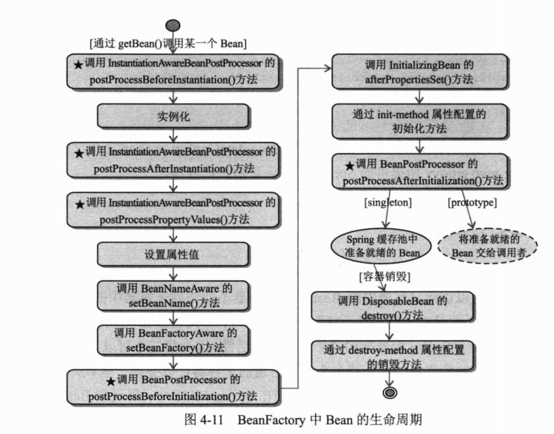

# 一.spring配置文件

```xml
<!--maven依赖-->
        <dependency>
            <groupId>org.springframework</groupId>
            <artifactId>spring-core</artifactId>
            <version>${spring.versin}</version>
        </dependency>
        <dependency>
            <groupId>org.springframework</groupId>
            <artifactId>spring-beans</artifactId>
            <version>${spring.versin}</version>
        </dependency>
        <dependency>
            <groupId>org.springframework</groupId>
            <artifactId>spring-context</artifactId>
            <version>${spring.versin}</version>
        </dependency>
```
通过以下一句话加载框架，并且注入所有的bean
```java
 ApplicationContext applicationContext = new ClassPathXmlApplicationContext("springAction.xml");
```

加载方式：

```xml
    <bean id="boss" class="com.pramy.po.Boss">
        <property name="car" ref="car"/>
        <property name="office" ref="office" />
      <!--依赖注入的一个条件就是boss中一定要有setCar()和setOffice()的方法-->
    </bean>
    <bean id="office" class="com.pramy.po.Office">
        <property name="officeNo" value="002"/>
    </bean>
    <bean id="car" class="com.pramy.po.Car" >
        <property name="brand" value=" 红旗 CA72"/>
        <property name="price" value="2000"/>
    </bean>
<!--boss两个成员变量分别依赖car 和office-->
```

一个bean元素是一个po ,id必须唯一，而且要指定class位置

spring是用反射机制加载类。

### ioc(inverse of controll)

控制翻转：所谓控制反转就是把创建对象和维护对象的关系从程序中转移到spring容器中(applicationContext),而程序本身不再维护了

### DI (denpendency injection) 依赖注入

# 二.注解

[**使用 @Autowired 注释**]()

Spring 2.5 引入了 `@Autowired` 注释，它可以对类成员变量、方法及构造函数进行标注，完成自动装配的工作，

Spring 通过一个 `BeanPostProcessor` 对 `@Autowired` 进行解析，所以要让`@Autowired` 起作用必须事先在 Spring 容器中声明`AutowiredAnnotationBeanPostProcessor` Bean

```xml
 <!--使用@Autowired必须注入这个bean-->
<bean class="org.springframework.beans.factory.annotation.AutowiredAnnotationBeanPostProcessor"/>

    <bean id="boss" class="com.pramy.po.Boss"/>
	<!--这里就可以省略对boss属性的引用-->
    <bean id="office" class="com.pramy.po.Office">
        <property name="officeNo" value="002"/>
    </bean>
    <bean id="car" class="com.pramy.po.Car" >
        <property name="brand" value=" 红旗 CA72"/>
        <property name="price" value="2000"/>
    </bean>
```

使用 `@Autowired` 注释，当 Spring 容器启动时，`AutowiredAnnotationBeanPostProcessor` 将扫描 Spring 容器中所有 Bean，一旦看到有 `@Autowired`的注释就会在容器中需找bean匹配，Spring使用的是**反射 **方式赋值，所以在Boss类中可以不需要set方法。

一旦使用了改标签，就必须要求在容器中找到该bean，否则会报BeanCreationException，但是可以通过**@Autowired(required = false)** 来取消报错

[**使用@Qualifier注释指定注入Bean名称**]()

```xml
<bean id="office" class="com.pramy.po.Office">
    <property name="officeNo" value="001"/>
</bean>
<bean id="office2" class="com.parmy.po.Office">
    <property name="officeNo" value="001"/>
</bean>
```

当配置文件中有两个一样类型的bean，用`@Autowired`会出错，所以可以用`@Qualifier` 来指定id注入

```java
             
@Autowired
public void setOffice(@Qualifier("office")Office office) {
    this.office = office;
}
```

[**使用 context:annotation-config 简化配置**]()

在开头可以加入

```xml
<beans xmlns="http://www.springframework.org/schema/beans"
    xmlns:xsi="http://www.w3.org/2001/XMLSchema-instance"
     xmlns:context="http://www.springframework.org/schema/context"
     xsi:schemaLocation="http://www.springframework.org/schema/beans 
 http://www.springframework.org/schema/beans/spring-beans-2.5.xsd
 http://www.springframework.org/schema/context 
 http://www.springframework.org/schema/context/spring-context-2.5.xsd">
 <!--必须在上面加入xsd-->
    <context:annotation-config/>
```

Spring 2.1 添加了一个新的 context 的 Schema 命名空间，该命名空间对注释驱动、属性文件引入、加载期织入等功能提供了便捷的配置。我们知道注释本身是不会做任何事情的，它仅提供元数据信息。要使元数据信息真正起作用，必须让负责处理这些元数据的处理器工作起来

[**使用 @Component和@scopee**]()

Spring 2.5 在 @Repository 的基础上增加了功能类似的额外三个注解：@Component、@Service、@Constroller，它们分别用于软件系统的不同层次：

- @Component 是一个泛化的概念，仅仅表示一个组件 (Bean) ，可以作用在任何层次。
- @Service 通常作用在业务层，但是目前该功能与 @Component 相同。
- @Constroller 通常作用在控制层，但是目前该功能与 @Component 相同。
- @Repository 标识为dao

通过在类上使用 @Repository、@Component、@Service 和 @Constroller 注解，Spring 会自动创建相应的 BeanDefinition 对象，并注册到 ApplicationContext 中。这些类就成了 Spring 受管组件。这三个注解除了作用于不同软件层次的类，其使用方式与 @Repository 是完全相同的

需要在xml中加入扫面器

```xml
<context:component-scan base-package="com.pramy.po"/>
<!--扫描该包下的所有bean-->
```

然后在在类的上面加上标签

```java
@Scope("prototype") //绑定生命周期
@Component //自动被扫面器扫描到，然后注入
public class Boss {
    @Autowired
    private Car car;
    @Autowired
    private Office office;

}
```

# 三 接口的好处

```java
interface A
class B implements A, class C implements A
```

B 和C 需要实现A接口的方法；根据需要可以在B,C的实现方法中写不同的逻辑

在xml中正常配置，记住，在配置文件中的class必须是实实在在的class。接口不行

```xml
<bean id="id" class="com.pramy.po.B"/>
<!--两个二选-->
<bean id="id" class="com.pramy.po.C"/>
```

```java
 ApplicationContext ctx =new ClassPathXmlApplicationContext(locations);
 A a = (A)ctx.getBean("id");//强转接口
a.action
 //这样子就可以通过在xml配置可以让接口A去实现B类的逻辑方法，或者C类的逻辑方法，达到降低耦合度的效果
```

# 四 生命周期socpe



实例化：当spring框架启动的时候，解析完配置文件的时候，就会把scope=singleton的bean加载到内存区。

首先调用无参构造器（默认）new出一个实例。然后调用set方法设置属性。

```java
public class Boss implements BeanNameAware,BeanFactoryAware,ApplicationContextAware,InitializingBean
```

实现了beanNameAware接口急需要实现方法：给你传入bean的id

BeanFactoryAware 给你传入BeanFactory

ApplicationContextAware给你传入ApplicationContext

[**BeanPostProcessor**]()

后置处理器，类似于web 中的filter

可以绑定bean，在xml中配置

首先创建一个bean 实现BeanPostProcessor接口，然后破实现其中的方法

```java
public class MyBeanPostProcessor implements BeanPostProcessor {
    @Override
    public Object postProcessBeforeInitialization(Object o, String s) throws BeansException {
        return o;
    }

    @Override
    public Object postProcessAfterInitialization(Object o, String s) throws BeansException {
        return o;
    }
}
```

然后再在xml中加载你这个bean

```xml
 <bean id="myBeanPostProcessor" class="com.pramy.po.MyBeanPostProcessor"/>
```


在每一次实现bean的是偶都会实现before()方法然后实现after()方法后再去调用bean

[**InitializingBean**]()

如果还实现了这个接口就会在`BeanPostProcessor` 的before和after方法之间实现InitializingBean中的`afterPropertiesSet()` 的方法，如果你在xml配置bean 的时候加入了`init-method`，接下来就会实现你自定义的方法

```xml
 <bean id="boss" init-method="init" class="com.pramy.po.Boss"/>
```

