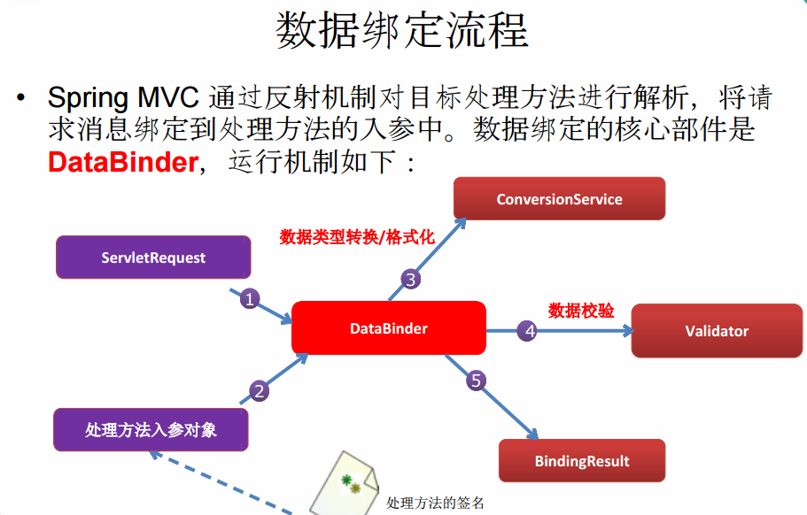
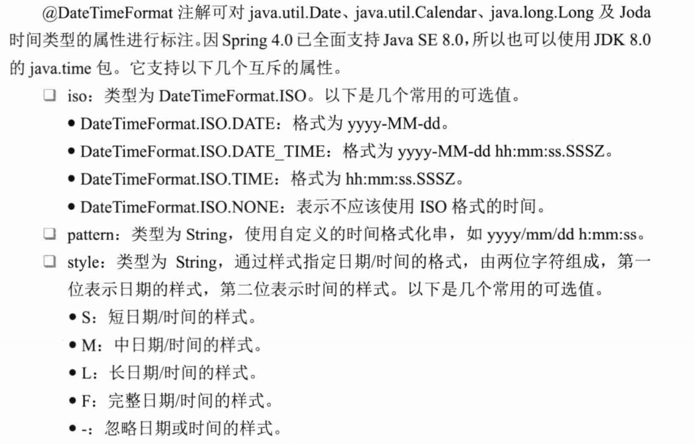
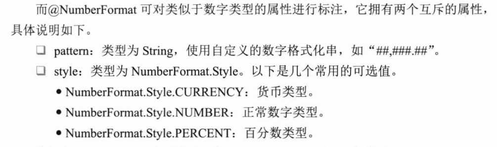
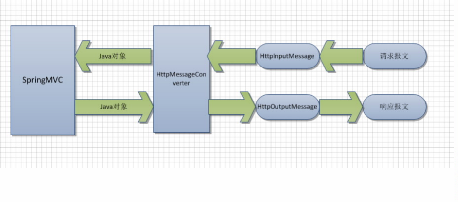
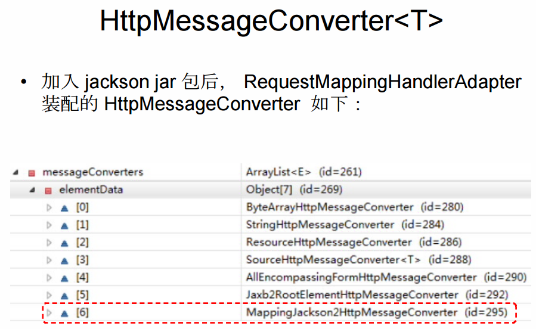
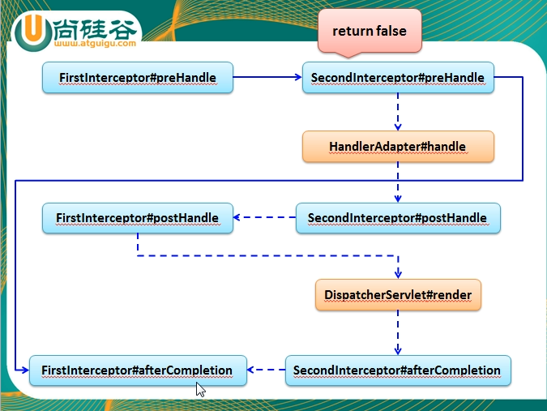
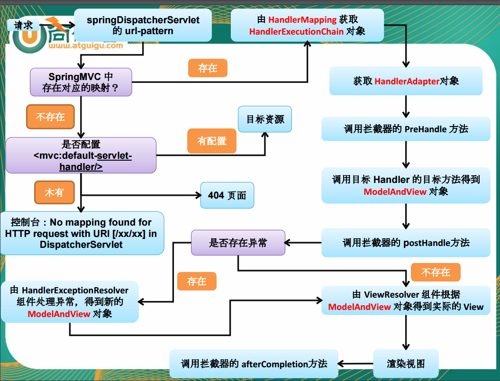

# 一 mvc的基本配置

首先在web.xml里面配置先启动springmvc的servlet

```xml
<servlet>
  <servlet-name>springDispatcherServlet</servlet-name>
  <servlet-class>org.springframework.web.servlet.DispatcherServlet</servlet-class>
  <init-param>
    <param-name>contextConfigLocation</param-name>
    <param-value>classpath:springmvc.xml</param-value>
  </init-param>
  <!--如果不填配置文件的话，默认的配置文件为: /WEB-INF/<servlet-name>-servlet.xml-->
  <load-on-startup>1</load-on-startup>
</servlet>
<servlet-mapping>
  <servlet-name>springDispatcherServlet</servlet-name>
  <url-pattern>/</url-pattern>
</servlet-mapping>
```

然后再controller写接收请求的bean

```java
@Controller
public class Hello {
  	//表示请求的路径
    @RequestMapping("/helloWorld")
    public String hello(){
        System.out.println("Hello");
        return "success";
    }
  //返回值相当于重定向，不过需要在spring.xml上面配置识图管理器
}
```

- 单独在类定义处使用：相对于WEB应用的根目录
- 单独在方法处使用：相对于WEB应用的根目录
- 如果在方法和类中同时使用，则方法的路径相当于类的路径的子路径


视图管理器

```xml
<context:component-scan base-package="com.pramy.handler"/>
<bean class="org.springframework.web.servlet.view.InternalResourceViewResolver">
  <!--前缀修饰，加后缀修饰最后变成/WEB-INF/views/success.jsp,相当于重定向到这-->
    <property name="prefix" value="/WEB-INF/views/"/>
    <property name="suffix" value=".jsp"/>
</bean>
```

## 指定请求方法，参数，头

请求参数

```java
@RequestMapping(value = "param",params = {"userName","age!=10","!sex"},method = RequestMethod.POST)
//意思就是参数一定要有userName而且age！=10而且不能带有sex,指定方法为post
//还可以用headers来指定请求头
```

## 路径匹配

- ?：匹配一个字符
- *：匹配多个字符
- **：匹配多层路径

## @PathVariable

```java
@RequestMapping(value = "/PathVariable/{id}")
public String PathVariable(@PathVariable("id")int id)
```

请求路径为/PathVariable/123，PathVariable可以将占位符数据映射为参数，注意数据类型要匹配，一般用来匹配基本数据类型

## 发送put请求和delete请求

1.首先需要在web.xml配置filter，而且必须发送post请求才可以转

```xml
  <!-- 配置HiddenHttpMethodFilter：可以把POST转化为DELETE和PUT请求 -->
  <filter>
    <filter-name>HiddenHttpMethodFilter</filter-name>
    <filter-class>org.springframework.web.filter.HiddenHttpMethodFilter</filter-class>
  </filter>

  <filter-mapping>
    <filter-name>HiddenHttpMethodFilter</filter-name>
    <url-pattern>/*</url-pattern>
  </filter-mapping>
```

2.在表单提交的时候需要加上隐藏域

```xml
<form action="/testRequestMapping/testRestDelete/1" method="post">
    <input type="hidden" name="_method" value="DELETE">
    <input type="submit">
</form>
```

## 获取参数

@RequestParam

```java
public String put(@RequestParam(value = "userName")String userName,@RequestParam(value = "password")String password)
```

- value 值即为请求参数的参数名
- required 该参数是否是必须的，默认值是true
- defaultValue 请求参数的默认值

## 获取cookiesId

```java
public String cookies(@CookieValue(value = "JSESSIONID")String id)
```


# 二 数据模型

## POJO的封装

支持对pojo的封装，自动匹配属性，支持级联属性

```xml
<form action="/spring/pojo" method="post">
    <input type="hidden" value="pramy" name="userName">
    <input type="hidden" name="password" value="123">
    <input type="hidden" name="cat.catName" value="cat">
    <input type="hidden" name="cat.color" value="white">
    <input type="submit" value="提交">
</form>
```
cat是user里面的对象

```java
@RequestMapping(value = "/pojo")
public String pojo(User user){
```

不紧如此还可以用到servlet原生的API

- HttpServletRequest
- HttpServletResponse
- HttpSession
- java.security.Principal
- Locale
- InputStream
- OutputStream
- Reader
- Writer 

## ModelAndView对象

```java
ModelAndView mv = new ModelAndView();
mv.addObject("user",user);
```

这个方法相当于request.setAttribute();

底层原理就是其中有一个map，然后遍历这个map，把它setAttribute进request中

## Map作为参数

当传入值是map的时候

```java
public String testMap(Map<String,Object>map)
```

但这个map是BindingAwareModelMap类型，当你往里面添加东西的时候实际上是向ModeAndView中添加对象，相当于添加到request中

## @ModelAttribute

在该连接该类的所有连接下最先执行

- 绑定请求参数到命令对象，然后放到视图里面

  ```java
  public String test(@ModelAttribute("user") UserModel user)   
  ```

  这与model.addAttribute("user", user)功能差不多

  ```java
  @ModelAttribute  
  public void populateModel(UserModel user, Model model) {  
    model.addAttribute("user", user);  
  }  
  ```
  - 如果没有`@SessionAttributes` 那么会从implicitModel中查找，如果有就当做参数，如果没有就new一个然后绑定


  - 如果类加上了`@SessionAttributes` 并且value中有key，则会先匹配value值，如果有的话就从session中获取值当做出入参数。如果没有就会报错


- 带有@ModelAttribute标识的函数的返回值如果是返回视图(view)里面，返回值的名称默认是以该返回类型的小写，但是也可以通过value来指定参数名称

  ```java
  @ModelAttribute  
  public void populateModel(UserModel user) {  
    return user
  }  
  //这样子相当于model.setAttribute("userModel",user)
  @ModelAttribute(value="user")
  public void populateModel(UserModel user) {  
    return user
  }  
  //这样子相当于model.setAttribute("user",user)
  ```

- 在视图层中如果有user的话，在具体的请求中也有user的话,会先获取视图中的值，如果有表单会进行二次封装

  ​

  总结：ModelAttribute标有的函数，优先级最高，可以往implicitModel添加东西，在请求方法中如果在参数上加上modelAttribute标签，它会先从implicitMode检索有没有（如果有指定value就以value值作为key去检索，如果没有就按类名第一个小写去检索），如果在没有表示SessionAttribute的前提下，它如果检索不到，就会从新new一个，如果有标识sessionAttribute，他就会匹配value值，如果成功就会从session中获取，如果session中没有就不会抛异常，如果没有匹配成功就会从implicitModel寻找或者从request中寻找


## 添加到session

```java
@SessionAttributes(value = "names",types = {String.class, User.class})
```

只能在类上面标记

- value：意思就是把key为names的值方法session中
- types：意思是把所有String类型和User类型的值都放到session中

## 直接页面跳转

在xml中配置

```xml
<mvc:view-controller path="/success" view-name="success"/>
<!--需要配上，要不然之前的连接都不行-->
<mvc:annotation-driven/>
```

# 三 视图

## 自定义视图

配置beanView解析器

```xml
<bean class="org.springframework.web.servlet.view.BeanNameViewResolver">
  <!--配置优先级-->
  <property name="order" value="100"/>
</bean>
```

control代码

```java
@RequestMapping(value = "/testView")
public String testView(){
    return "helloView";
}
```

自定义的view

```java
@Component
public class HelloView implements View {
    @Override
    public String getContentType() {
        return "text/html";
    }

    @Override
    public void render(Map<String, ?> model, HttpServletRequest request, HttpServletResponse response) throws Exception {
        response.getWriter().print("time:"+new Date());
    }
}
```

首先return回去的“helloView”被beanNameViewResolver解析其中，它会以name从容器中获取bean

```java
//所以自定义的view一定要加进spring容器里面
return context.getBean(viewName, View.class);
```

## 重定向和请求转发

在return 返回值如果是“redirect:index.jsp” 重定向到index.jsp

如果是“forward:index.jsp”请求转发到index.jsp

## 处理静态资源

可以在 SpringMVC 的配置文件中**配置\<mvc:default-servlet-handler/> 的方式解决静态资源**的问题：

- \<mvc:default-servlet-handler/> 将在 SpringMVC 上下文中定义一个DefaultServletHttpRequestHandler，它会对进入 DispatcherServlet 的请求进行筛查，如果发现是没有经过映射的请求，就将该请求交由 WEB应用服务器默认的 Servlet 处理，如果不是静态资源的请求，才由DispatcherServlet 继续处理
- 一般 WEB 应用服务器默认的 Servlet 的名称都是 default。若所使用的WEB 服务器的默认 Servlet 名称不是 default，则需要通过 default-servlet-name 属性显式指定 

## mvc自动注册

- \<mvc:annotation-driven /> 会自动注册RequestMappingHandlerMapping、RequestMappingHandlerAdapter 与ExceptionHandlerExceptionResolver 三个bean。
- 还将提供以下支持：
  - 支持使用 ConversionService 实例对表单参数进行类型转换
  - 支持使用 @NumberFormat annotation、@DateTimeFormat注解完成数据类型的格式化
  - 支持使用 @Valid 注解对 JavaBean 实例进行 JSR 303 验证
  - 支持使用 @RequestBody 和 @ResponseBody 注解 

## 自定义类型转换器

ConversionService 是 Spring 类型转换体系的核心接口。

- 可以利用 ConversionServiceFactoryBean 在 Spring 的 IOC容器中定义一个 ConversionService. Spring 将自动识别出IOC 容器中的 ConversionService，并在 Bean 属性配置及Spring MVC 处理方法入参绑定等场合使用它进行数据的转换
- 可通过 ConversionServiceFactoryBean 的 converters 属性注册自定义的类型转换器 

自己写的转换器:

```xml
<mvc:annotation-driven conversion-service="conversionService"/>
<!--配置conversionService-->
<bean name="conversionService" class="org.springframework.context.support.ConversionServiceFactoryBean">
    <property name="converters">
        <list>
            <bean class="com.spring.mvc.UserConverter"/>
        </list>
    </property>
</bean>
```
Converter\<S,T>：将 S 类型对象转为 T 类型对象

需要实现这个接口，然后重写方法，然后加到ioc容器里面

## 数据绑定



## @InitBinder

- 由 @InitBinder 标识的方法，可以对 WebDataBinder 对象进行初始化。WebDataBinder 是 DataBinder 的子类，用于完成由表单字段到 JavaBean 属性的绑定
- @InitBinder方法不能有返回值，它必须声明为void。
- @InitBinder方法的参数通常是是 WebDataBinder 

## 数据格式化

注解:需要加上`<mvc:annotation-driven />`

```java
    @DateTimeFormat(pattern = "yyyy-MM-dd",iso = DateTimeFormat.ISO.TIME)
    private Date date;
    @NumberFormat(style = NumberFormat.Style.CURRENCY)
    private float salary;
```

### @DateTimeFormat:互斥属性


### @NumberFormat:互斥属性 


## 数据验证

需要配置`<mvc:annotation-driven />`

```xml
<dependency>
    <groupId>org.hibernate</groupId>
    <artifactId>hibernate-validator</artifactId>
    <version>5.1.0.Final</version>
</dependency>
<dependency>
    <groupId>javax.validation</groupId>
    <artifactId>validation-api</artifactId>
    <version>1.1.0.Final</version>
</dependency>
```

然后在po里面可以加上注解

```java
    @NotEmpty
    private String userName;
    @NotEmpty(message = "密码不能为空")
    private String password;
    @Past(message = "不能比今天晚")
    @DateTimeFormat(iso = DateTimeFormat.ISO.DATE)
    private Date date;

    private float salary;
    @Email(message = "邮箱格式有误")
    private String email;
```

在controller方法中要加上@valid 后面接要验证的对象，**而且后面一定要加上 BindingResult ** ，对象和绑定结果一定要一对一对出现

```java
public String valid(@Valid @ModelAttribute("user") User user, BindingResult bindingResult){
    if(bindingResult.hasErrors()){
        System.out.println(user);
        List<FieldError>list = bindingResult.getFieldErrors();
        for (FieldError e :
                list) {
            System.out.println(e.getField());
        }
        return "user/error";
    }else{
        return SUCCESS;
    }
}
```

| 注解                                       | 运行时检查                                    |
| ---------------------------------------- | ---------------------------------------- |
| @AssertFalse                             | 被注解的元素必须为false                           |
| @AssertTrue                              | 被注解的元素必须为true                            |
| @DecimalMax(value)                       | 被注解的元素必须为一个数字，其值必须小于等于指定的最小值             |
| @DecimalMin(Value)                       | 被注解的元素必须为一个数字，其值必须大于等于指定的最小值             |
| @Digits(integer=, fraction=)             | 被注解的元素必须为一个数字，其值必须在可接受的范围内               |
| @Future                                  | 被注解的元素必须是日期，检查给定的日期是否比现在晚                |
| @Max(value)                              | 被注解的元素必须为一个数字，其值必须小于等于指定的最小值             |
| @Min(value)                              | 被注解的元素必须为一个数字，其值必须大于等于指定的最小值             |
| @NotNull                                 | 被注解的元素必须不为null                           |
| @Null                                    | 被注解的元素必须为null                            |
| @Past(java.util.Date/Calendar)           | 被注解的元素必须过去的日期，检查标注对象中的值表示的日期比当前早         |
| @Pattern(regex=, flag=)                  | 被注解的元素必须符合正则表达式，检查该字符串是否能够在match指定的情况下被regex定义的正则表达式匹配 |
| @Size(min=, max=)                        | 被注解的元素必须在制定的范围(数据类型:String, Collection, Map and arrays) |
| @Valid                                   | 递归的对关联对象进行校验, 如果关联对象是个集合或者数组, 那么对其中的元素进行递归校验,如果是一个map,则对其中的值部分进行校验 |
| @CreditCardNumber                        | 对信用卡号进行一个大致的验证                           |
| @Email                                   | 被注释的元素必须是电子邮箱地址                          |
| @Length(min=, max=)                      | 被注解的对象必须是字符串的大小必须在制定的范围内                 |
| @NotBlank                                | 被注解的对象必须为字符串，不能为空，检查时会将空格忽略              |
| @NotEmpty                                | 被注释的对象必须为空(数据:String,Collection,Map,arrays) |
| @Range(min=, max=)                       | 被注释的元素必须在合适的范围内 (数据：BigDecimal, BigInteger, String, byte, short, int, long and 原始类型的包装类 ) |
| @URL(protocol=, host=, port=, regexp=, flags=) | 被注解的对象必须是字符串，检查是否是一个有效的URL，如果提供了protocol，host等，则该URL还需满足提供的条件 |

## 错误回显和国际化

```xml
<!--modelAttribute是绑定错误对象的，一定要填-->
<form:form modelAttribute="user" method="post">
    userName：<form:input path="userName" /><br/>
  	<!--使用form:errors标签可以显示错误信息-->
    <form:errors path="userName"/><br/>
    password：<form:input path="password" /><br/>
    <form:errors path="password"/><br/>
    email：<form:input path="email" /><br/>
    <form:errors path="email"/><br/>
    date：<form:input path="date" /><br/>
    <form:errors path="date"/><br/>
    salary：<form:input path="salary" /><br/>
    <form:errors path="salary" /><br/>
    <input type="submit" value="Submit" />
</form:form>
```

# 四 respondBody和requestBody

## 处理json对象

```xml
<!--导入jar包-->
<dependency>
    <groupId>com.fasterxml.jackson.core</groupId>
    <artifactId>jackson-core</artifactId>
    <version>${json.version}</version>
</dependency>
<dependency>
    <groupId>com.fasterxml.jackson.core</groupId>
    <artifactId>jackson-databind</artifactId>
    <version>${json.version}</version>
</dependency>
<dependency>
    <groupId>com.fasterxml.jackson.core</groupId>
    <artifactId>jackson-annotations</artifactId>
    <version>${json.version}</version>
</dependency>
```

然后直接返回对象，但是要在被调用方法上面加上@ respondBody

## HttpMessageConverter

处理流程：

DispatcherServlet默认装配RequestMappingHandlerAdapter，加了json的jar包后，处理类型如下



处理器的选择是看泛型，传入是什么类型，@RequestBody就会调用相对应的处理器，@RespondBody看返回值类型

## 文件上传下载MultipartResolver

```xml
<!--文件上传下载-->
<bean id="multipartResolver" class="org.springframework.web.multipart.commons.CommonsMultipartResolver">
    <property name="defaultEncoding" value="UTF-8"/>
</bean>
```

相关依赖

```xml
<dependency>
    <groupId>commons-fileupload</groupId>
    <artifactId>commons-fileupload</artifactId>
    <version>1.3.3</version>
</dependency>
<dependency>
    <groupId>commons-io</groupId>
    <artifactId>commons-io</artifactId>
    <version>2.5</version>
</dependency>
```

函数：

```java
@RequestParam("file")MultipartFile file
```

## 拦截器

自定义拦截器需要实现**HandlerInterceptor** 接口

其中有三个方法：

```java
@Override
public boolean preHandle(HttpServletRequest request, HttpServletResponse response, Object handler) throws Exception {
    System.out.println("preHandle");
    return true;
}
@Override
public void postHandle(HttpServletRequest request, HttpServletResponse response, Object handler, ModelAndView modelAndView) throws Exception {
    System.out.println("postHandle");
}
@Override
public void afterCompletion(HttpServletRequest request, HttpServletResponse response, Object handler, Exception ex) throws Exception {
    System.out.println("afterCompletion");
}		
```

- preHandle：是在目标方法被调用前调用，如果返回的是false后面的拦截器就不会被调用
- postHandle：是在目标方法调用后，渲染视图之前被调用，在这里可以对视图对象修改
- afterCompletion：在渲染视图之后被调用

然后在xml上面配上拦截器

```xml
<mvc:interceptors>
    <bean class="com.pramy.bind.interceptor.MyIntercept" />
</mvc:interceptors>
```

### 自定义拦截路径

在xml中可以配置

```xml
<mvc:interceptors>
    <mvc:interceptor>
        <mvc:mapping path="/"/>
        <mvc:mapping path="/bind"/>
        <bean class="com.pramy.bind.interceptor.MyIntercept"/>
    </mvc:interceptor>
</mvc:interceptors>
```

在子元素`<mvc:interceptor>` 中配置拦截的url，可以配置多个url，同时也可以去除拦截的url，

多个拦截器的原理



# 五 异常

## @ResponseStatus

可以标记一个方法，也可以标记一个方法。

value：状态码(HttpStatus.code)

reason：返回的原因

如果标记方法的话，一样会抛出异常，但是方法正常运行

# 六 MVC运行



