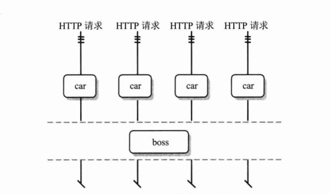
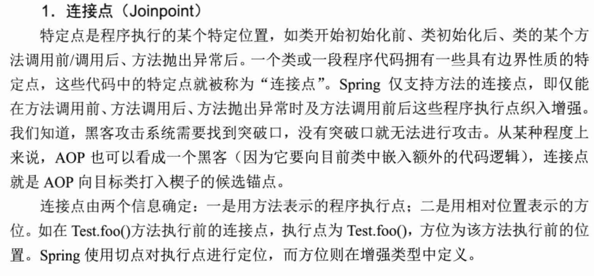
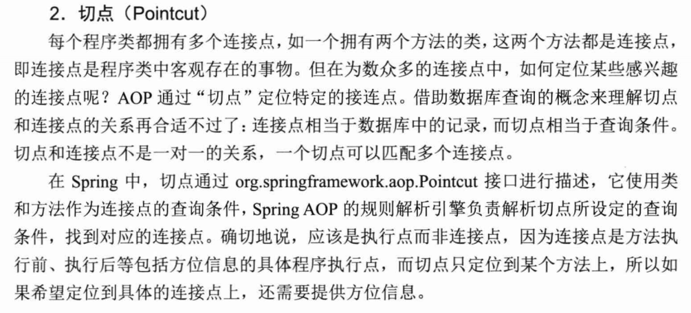
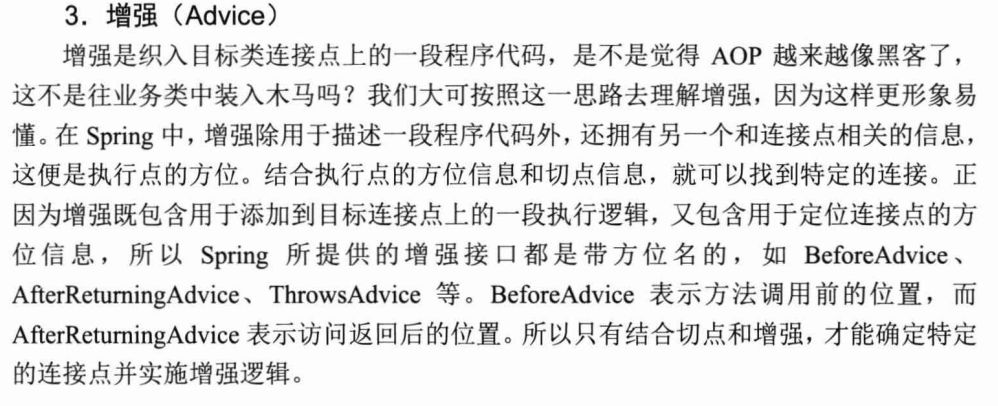
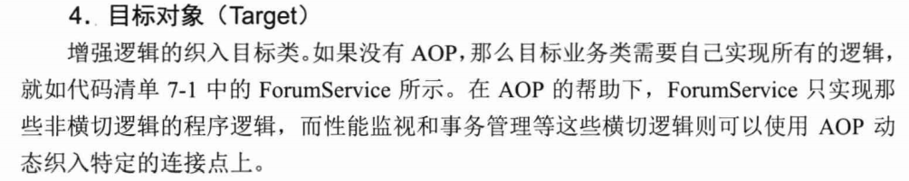
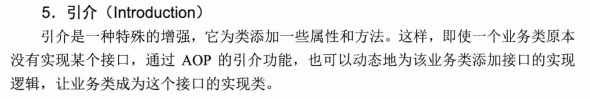
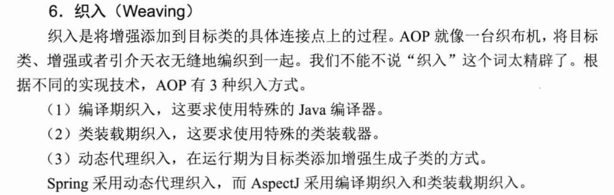
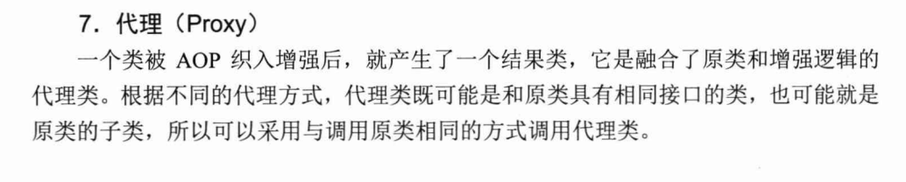
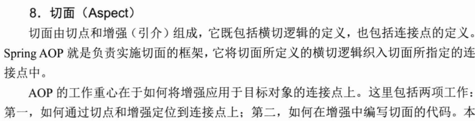

# 精通Spring+4.x++企业应用开发实战

## 第四章

4.2.2 类加载器ClassLoader

- 类装载机制
  - 装载，连接（校验，给静态变量分配空间，解析），初始化（对类的静态变量，静态代码块初始化）
  - ClassLoader：根加载器
  - ExtClassLoader：扩展类装载器
  - AppClassLoader：应用类装载器

其中跟装载器不是ClassLoader的子类，底层实现是c++，在运行时负责加载jre核心库（rt.jar,charsets.jar）

ExtClassLoader和AppClassLoader都是ClassLoader的子类，AppClassLoader负责加载ClassPath路径下的jar包，而ExtClassLoader负责加载jre目录下的ext中jar包，根加载器在jvm中属于底层，在程序中不可见，但是三个加载器之间有着明显的父子层级。

ExtClassLoader是AppClassLoader的父装载器，一般默认用AppClassLoader加载类，jvm加载使用“全盘责任委托机制”：先委托父加载器去寻找目标类，在找不到的时候自己才会从自己的方式中加载

## 第五章

### 5.3.3工厂注入

```java
public class CarFactory {
   public Car createHongQiCar(){
	   Car car = new Car();
	   car.setBrand("红旗CA72");
	   return car;
   }
   
   public static Car createCar(){
	   Car car = new Car();
	   return car;
   }
}

```

- 通过工厂类注入

  ```xml
  	<!--首先定义工厂类-->
  	<bean id="carFactory" class="com.smart.ditype.CarFactory" />
  	<!--然后配置Bean，说明使用工厂carFactory的createHongQiCar来创建-->
  	<bean id="car5" factory-bean="carFactory" factory-method="createHongQiCar"/>
  ```

- 通过静态工厂注入

  ```xml
  <!--指定工厂类，然后调用它的静态构造方法-->
  <bean id="car6" class="com.smart.ditype.CarFactory" factory-method="createCar"/>
  ```

### 5.4.1字面值

XML特殊标签<![CDATA[ ]]>，这标签的作用就是让XML解析器将标签中的字符串当做普通的文本对待，防止对特殊字符对XML解析造成影响

一般XML会忽略元素标签内部字符串的前后空格，但是spring不会

### 5.4.2引用其他Bean

```xml
<ref bean=""/>或者<ref local=""/>或者<ref praent=""/>
```

bean：可以用引用同一容器或者父类容器的bean

local：引用本地

praent：引用父类的

### 5.4.4null

如果用`<value></value>`的方式给bean赋值，只会得到空字符串，不会的到null，必须用null元素标签`<value><null/></value>`

### 5.4.5级联属性

```xml
<bean id="boss" class="com.smart.attr.Boss">
	<property name="car.brand" value="111"/>
</bean>
```

我们为boss类里面的car对象的brand元素赋值，但是前提是boss对象里面存在car实例

### 5.6.1继承

```xml
    <!-- 父子<bean> -->
	<bean id="abstractCar" class="com.smart.tagdepend.Car"
	      p:brand="红旗CA72" p:price="2000.00" p:color="黑色"
	      abstract="true"/>
	<bean id="car3" parent="abstractCar">
		<property name="color" value="红色"/>
	</bean>
	<bean id="car4" parent="abstractCar" >
		<property name="color" value="白色"/>
	</bean>	
```

子类继承父类的信息，并且重新给属性color赋值，父类的主要功能是简化子类的配置，所以声明**abstract=true **，这表示spring Ioc容器不会实例化这个bean

### 5.6.2依赖

一般情况下我们用ref来表示对其他bean的依赖，但是这bean是死的，所有属性都定死。

这时候就可以用依赖关系来实现，用**depends-on ** 显示来指定依赖关系

```xml
<!-- <bean>的信赖 -->
	<bean id="cacheManager" class="com.smart.tagdepend.CacheManager" depends-on="sysInit" />
	<bean id="sysInit" class="com.smart.tagdepend.SysInit" />
```

在实例化cacheManager之前会先实例化sysinit，你就可以在sysinit里写各种各样的操作

比如A-->B  但是可以显式 指定A ：depends-on C     ，C可以在对B的属性的修改，达到A动态变化的效果

### 5.6.3引用

`ref`和`idref` 的区别

ref是引用bean实例，idref是引用该bean的id 或者是name，相当于value元素，当时value是没有具备检验功能的，但是idref是有的，会检查该容器中是否有这个bean存在，如果没有回抛出**BeanDefinitionStoreException **

### 5.7 整合多个配置文件

```xml
<import resource="classpath:com/samrt/impt/beans1.xml"/>
<!--可以通过引入另外一个配置文件，达到拥有完全的属性-->
```

a.xml引入b.xml，spring在启动的时候就会只加载a.xml就可以了，不引入的情况就是会同时加载a.xml和b.xml然后再内容中合并

### 5.8单例模式singleton

在内存中只有一个实例，在spring默认的方式就是单例模式，但是这有一个点，在spring启动的时候会去实例化一个bean但是如果这个bean被实例化了但是很久都没有用到，或者是用户的业务逻辑没有使用到这个bean，就造成了浪费，所以采用懒加载的模式，在bean后面加上一个`lazy-init=true` 的元素,就是在用户使用的时候才会被实例化

### 5.8.4作用域依赖问题

```xml
<bean name="car" class="com.smart.scope.Car" scope="request">
	<!--需要用到aop命名空间，创建代理-->	
	<aop :scoped-proxy/>	
</bean>
<bean id="boss" class="com.smart.scope.Boss">
  	<!--引用相关作用域的car Bean-->
	<propertry name="car" ref="car"/>  
</bean>
```



由于boss是单实例的每一次request都应当实例相对作用域的car，所以引入aop代理的概念，代理给boss和car做了桥接，当boss Bean在Web环境下调用car Bean时，Spring AOP将启动动态代理只能判断boss位于哪一个HTTP请求中，并且让boos引用到相应的HTTP请求的car Bean中

但是启动代理之后直接被boss引用的不是car Bean 而是AOP代理

### 5.10.2扫描注解定义的bean

 @Value("#{beanName.propName}")

# 第七章 AOP

### 7.12AOP术语：

















### 7.2.1

JDK的动态代理，CGLib的动态代理

区别在于JDK只支持接口代理，不支持类的代理

**JDK代理 **

```java
public class PerformaceHandler implements InvocationHandler {
    private Object target;
	public PerformaceHandler(Object target){
		this.target = target;
	}
	public Object invoke(Object proxy, Method method, Object[] args)
			throws Throwable {
		PerformanceMonitor.begin(target.getClass().getName()+"."+ method.getName());
		Object obj = method.invoke(target, args);
		PerformanceMonitor.end();
		return obj;
	}
}
```

使用：

```java
		ForumService target = new ForumServiceImpl();
		PerformaceHandler handler = new PerformaceHandler(target);
		ForumService proxy = (ForumService) Proxy.newProxyInstance(target
				.getClass().getClassLoader(),
				target.getClass().getInterfaces(), handler);
```

CglibProxy代理

```java
public class CglibProxy implements MethodInterceptor {
	private Enhancer enhancer = new Enhancer();

	public Object getProxy(Class clazz) {
		enhancer.setSuperclass(clazz);
		enhancer.setCallback(this);
		return enhancer.create();
	}

	public Object intercept(Object obj, Method method, Object[] args,
			MethodProxy proxy) throws Throwable {
		PerformanceMonitor.begin(obj.getClass().getName()+"."+method.getName());
		Object result=proxy.invokeSuper(obj, args);
		PerformanceMonitor.end();
		return result;
	}
}
```

使用

```java
CglibProxy cglibProxy = new CglibProxy();
		ForumService forumService = (ForumService)cglibProxy.getProxy(ForumServiceImpl.class);
```

CGLib是采用拦截父类方法，通过创建子类的方式生成代理对象，所以不能对目标类中final或者private方法进行代理

