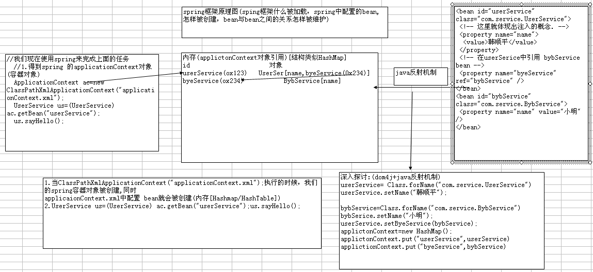
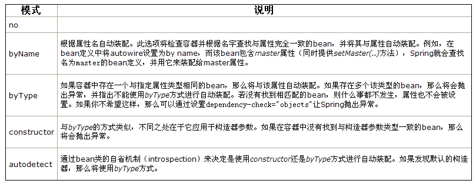

# Spring

- 容器框架，用于配置bean，并维持bean之间关系的框架。当我们需要使用某个bean的时候，我们可以getBean(id),使用即可。

  

- 概念：

  - ioc(inverse of controll ) 控制反转: 所谓控制反转就是把创建对象(bean),和维护对象(bean)的关系的权利从程序中转移到spring的容器(applicationContext.xml),而程序本身不再维护.
  - DI(dependency injection) 依赖注入: 实际上di和ioc是同一个概念，spring设计者认为di更准确表示spring核心技术

- Spring运行原理图

  

- application.xml中会配置很多个bean，这些bean会对应class会对应java类，通过getBean("id")把配置的id作为参数可以拿到java类的实例。

- bean中可以设置参数，如果参数后面跟有ref，就表示和其他的bean关联

## Spring Begin

1. 引入jar：最小配置spring.jar 该包把常用的jar都包括, 还要 写日志包 common-logging.jar

   - [spring各个jar的作用](http://www.cnblogs.com/BensonHe/p/3903050.html)

2. 创建Spring核心文件：applicationContext.xml，该文件中引入 xsd文件

   xsd:

   ```xml
   <?xml version="1.0" encoding="UTF-8"?>
   <beans xmlns="http://www.springframework.org/schema/beans"
          xmlns:xsi="http://www.w3.org/2001/XMLSchema-instance" xmlns:aop="http://www.springframework.org/schema/aop"
          xmlns:tx="http://www.springframework.org/schema/tx" xmlns:context="http://www.springframework.org/schema/context"
          xsi:schemaLocation="  
   http://www.springframework.org/schema/beans http://www.springframework.org/schema/beans/spring-beans-3.0.xsd  
   http://www.springframework.org/schema/tx http://www.springframework.org/schema/tx/spring-tx-3.0.xsd  
   http://www.springframework.org/schema/aop http://www.springframework.org/schema/aop/spring-aop-3.0.xsd  
   http://www.springframework.org/schema/context http://www.springframework.org/schema/context/spring-context-3.0.xsd">
       
   </beans>
   ```

   [解析](http://www.cnblogs.com/doit8791/p/5757798.html)

3. 配置Bean

   ```xml
   <!-- 在容器文件中配置bean(service/dao/domain/action/数据源) -->
   <bean id="userService" class="com.service.UserService">
   	<!-- 这里就体现出注入的概念. -->
   	<property name="name">
   		<value>韩顺平</value>
   	</property>
   </bean>
   <!--
   相当于：	
   	UserService userSerivce=new UserService();
   	userSerivce.setName("韩顺平");
   -->
   ```

   bean元素的作用：当我们的spring框架加载时候，spring就会自动的创建一个bean对象，并放入内存 

   - <property>里面装的是成员变量，name对应成员变量的属性名，value对应成员变量的值，ref是对另一个bean的引用作为成员变量

4. Test

   ```java
   //1.得到spring 的applicationContext对象(容器对象)
   ApplicationContext ac = new ClassPathXmlApplicationContext("applicationContext.xml");
   UserService us=(UserService) ac.getBean("userService");
   //getBean方法拿到实例之后就可以调用bean中的方法了
   ```

## 三种获得ApplicationContext的方法

1. ClassPathXmlApplicationContext :通过类路径

2. FileSystemXmlApplicationContext :通过文件路径

   举例:

   ```java
   ApplicationContext ac=new FileSystemXmlApplicationContext("D:\\...\\beans.xml");
   ```

3. XmlWebApplicationContext :从web系统中加载（tomcat启动时加载）

## Bean

### 获取bean

- 方式一：从ApplicationContex 应用上下文容器中获取bean

  ```java
  ApplicationContext ac=new ClassPathXmlApplicationContext("com/hsp/ioc/beans.xml");
  Check check = (Check) ac.getBean("checkLogin");
  ```

  - 如果使用ApplicationContext ，则配置的bean如果是 singlton不管是否使用，都被实例化  

     **好处就是可以预先加载,缺点就是耗内存**

  - 会预先加载所有的单例Bean，这样可以确保不需要等待他们被创建

- 方式二：从bean工厂中获取bean

  ```java
  BeanFactory factory = new XmlBeanFactory(new ClassPathResource("com/hsp/ioc/beans.xml"));
  factory.getBean("student");
  ```

  - 如果是 BeanFactory ,当获取beanfacotry时候，配置的bean不会马上被实例，当使用的时候，才被实例 

     **好处节约内存,缺点就是速度**

- 一般没有特殊要求，应当使用ApplicatioContext完成(90%)，一般方式二用于手机应用

### Bean的作用域（scope）


- 默认是singleton，单例的

- scope是singleton的时候如果使用（方式一）

  ```java
  ApplicationContext ac = new ClassPathXmlApplicationContext("applicationContext.xml")
  ```

  则spring就会把applicationContext.xml中的bean实例化，其他的情况下都需要getBean才会把相应的bean实例化

  - 如果希望不提前实例化singleton的Bean，可以通过lazy-init="true"来进行控制

    但是在某些情况下还是会提前实例化：如果该Bean被其他需要提前实例化的Bean所引用

- prototype：每次被引用或者getBean都是一个新的实例

  - 默认情况下，Spring容器在启动时不实例化prototype的Bean
  - 容器将prototype的Bean交给调用者后，就不再接管它的生命周期了

- request，session，global session是web开发会用到的

  - 配置:
  - 作用域：request，session和web中的对应
  - 作用域：global session类似于session，被Portlet Web应用的所有子Portlet共享，在非Protlet Web应用环境下等价于session。

### Bean的生命周期

1. 实例化bean：把bean实例化到内存。（当程序加载beans.xml文件，并且scope=singleton的时候）

2. 设置属性：调用bean的set方法设置属性

    可选项：（bean对应的类去实现对应的接口）

3. 通过setBeanName获取id号：需要实现bean名字关注接口（BeanNameAware）

4. 获得BeanFactory：需要实现bean工厂关注接口(BeanFactoryAware)

5. 获得ApplicationContext ：需要实现ApplicationContextAware接口

   实现setApplicationContext方法可以获得ApplicationContext 作为参数获得

   ```java
   //该方法传递ApplicationContext
   public void setApplicationContext(ApplicationContext arg0) throws BeansException {
     	//arg0是我们得到的ApplicationContext
   	System.out.println("setApplicationContext"+arg0);
   }
   ```

6. 后置处理器关联（before）：会自动去调用 Object postProcessBeforeInitialization方法 

   关联配置：

   ```xml
   <bean id="myBeanPostProcessor" class="自己后置处理器的全类名" />
   ```

7. 调用 afterPropertiesSet：需要实现InitializingBean 接口

8. 自定义初始化方法：通过\<bean init-method=”init” /> 配置

9. 后置处理器关联（after）：会自动去调用 Object postProcessAfterInitialization方法

10. 使用bean

11. 容器关闭

12. destory方法：需实现DisposableBean

13. 自定义销毁方法：在\<bean destory-method=”fun1”/> 调用

    >  实际开发中常见的（有可能用到）的是：1->2->6->10->9->11 

- 通过BeanFactory来获取bean对象：生命周期和Applicationcontext 不一样

  5、6、9都没有，即和ApplicationContextAware接口还有后置处理器相关的步骤

- 后置处理器：所有bean的创建都需要经过它，有点类似filter

### 装配bean

- 尽量使用scope = “singleton”, 不要使用prototype，因为这样会对我们的性能影响比较大

  #### 给集合类注入值

  - Array数组：

    ```xml
    <!-- 给数组注入值 -->
    <property name="empName">
    	<list>
    		<value>小明</value>
    		<value>小明明</value>
    		<value>小小明</value>
    	</list>
    </property>
    ```

  - List:(有序)

    ```xml
    <!-- 给list注入值 list 中可以有相当的对象 -->
    <property name="empList">
    	<list>
    	<!--ref表示引用其他的bean，如果是基本数据类型可以直接赋值-->
    		<ref bean="emp2" />
    		<ref bean="emp1"/>
    		<ref bean="emp1"/>
    		<ref bean="emp1"/>
    		<ref bean="emp1"/>
    		<ref bean="emp1"/>
    		<ref bean="emp1"/>
    	</list>
    </property>
    ```

  - Set：(无序，注入相同对象的时候只会保留最后一次注入结果)

    ```xml
    <!-- 给set注入值 set不能有相同的对象 -->
    <property name="empsets">
    	<set>
    		<ref bean="emp1" />
    		<ref bean="emp2"/>
    		<ref bean="emp2"/>
    		<ref bean="emp2"/>
    		<ref bean="emp2"/>
    	</set>
    </property>
    ```

  - Map：(有多个Key相同的时候，以最后一个注入为准)

    ```xml
    <!-- 给map注入值 map只有key不一样，就可以装配value -->
    <property name="empMaps">
    	<map>
    		<entry key="11" value-ref="emp1" /> 
    		<entry key="22" value-ref="emp2"/>
    		<entry key="33" value-ref="emp1"/>
    	</map>
    </property>
    ```
    ```xml
    <!--如果键和值都是对象，可以用<ref>标签配置-->
    <property name="empMaps">
    	<map>
          <entry>
            <key><value>11</value></key>
            <value>value11</value>
          </entry>
          <entry>
            <key><value>22</value></key>
            <value>value22</value>
          </entry>
    	</map>
    </property>
    ```

  - Properties： (结构就像Map\<Stirng, String>一样)

    ```xml
    <property name="pp">
    	<props>
    		<prop key="pp1">abcd</prop>
    		<prop key="pp2">hello</prop>
    	</props>
    </property>
    ```

  #### 内部bean

  缺点：无法在其他地方引用重用这个内部bean

  ```xml
  <bean id=”foo” class=”....Foo”>
  	<property name=”属性”>
  		<!—第一方法引用-->
  		<ref bean=’bean对象名’/>
        
  		<!—内部bean-->
  		<bean> 
  			<property></property>
  		</bean>
  	</property>
  </bean>
  ```

  #### 继承配置

  ```java
  public class Student 
  public class Gradate extends Student
  ```

  在xml中体现继承：

  ```xml
  <bean id="student" class="com.hsp.inherit.Student">
  	<property name="name" value="顺平" />
  	<property name="age" value="30"/>
  </bean>
  <!-- 配置Grdate对象 -->
  <bean id="grdate" parent="student" class="com.hsp.inherit.Gradate">
  	<!-- 如果自己配置属性name,age,则会替换从父对象继承的数据  -->
  	<property name="name" value="小明"/>
  	<property name="degree" value="学士"/>
  </bean>
  ```

  #### 通过构造函数注入值(上面的方法都是通过set方法注入的)

  beans.xml 关键代码:

  ```xml
  <!-- 配置一个雇员对象 -->
  <bean id="employee" class="com.hsp.constructor.Employee">
  	<!-- 通过构造函数来注入属性值 -->	
  	<constructor-arg index="0" type="java.lang.String" value="大明" />
  </bean>
  ```

  - index:第几个属性值
  - type:属性值类型
  - value:属性值

  #### 自动装配

  没有直接指定属性值的属性才会自动装配

  

  - byName：bean对应的类的属性名如果和其他bean的id相同，那么其他bean就会装配的bean中

  - byType：寻找和属性类型相同的bean,找不到则装配不上,找到多个会抛异常

  - constructor：查找和bean的构造参数（没有被装配到的参数）一致的一个或多个bean，若找不到或找

    ​			   到多个，抛异常。（按照参数的类型装配）（只调用没被赋值的属性组合成的构造方法）

  - default：需要在\<beans defualt-autorwire=“指定” />指定，bean默认的autowire就是指定的装配方法

    ​		（autorwire的默认值是no）

  - no：不自动装配

  #### 使用注解配置

  - 激活注解(在\<beans>中添加)

    ```xml
    <context:annotation-config/>
    ```

  #### 分散配置

  说明: 当通过 context:property-placeholder 引入 属性文件的时候，有多个需要使用 ","间隔

  ```xml
  <!-- 引入我们的db.properties文件 -->
  <context:property-placeholder location="classpath:com/hsp/dispatch/db.properties,classpath:com/hsp/dispatch/db2.properties"/>

  <!-- 配置一DBUtil对象 $占位符号 -->
  <bean id="dbutil" class="com.hsp.dispatch.DBUtil">
  <property name="name" value="${name}" />
  <property name="drivername" value="${drivername}" />
  <property name="url" value="${url}" />
  <property name="pwd" value="${pwd}" />
  </bean>

  <!-- 配置一DBUtil对象 -->
  <bean id="dbutil2" class="com.hsp.dispatch.DBUtil">
  <property name="name" value="${db2.name}" />
  <property name="drivername" value="${db2.drivername}" />
  <property name="url" value="${db2.url}" />
  <property name="pwd" value="${db2.pwd}" />
  </bean>
  ```

  db.properties:

  ```
  name=scott
  drivername=oracle:jdbc:driver:OracleDirver
  url=jdbc:oracle:thin:@127.0.0.1:1521:hsp
  pwd=tiger
  ```

  \<context:property-placeholder location=“                ”/>	引入属性文件

  ​			${          }									使用属性

## 代理

### 静态代理


静态代理角色分析

- 抽象角色：一般使用接口或者抽象类来决定
- 真实角色：被代理的角色
- 代理角色：代理真实角色，代理真实角色后一般会做一些附属操作
- 客户：使用代理角色来进行一些操作

优点：

- 使得真实角色处理的业务更加存粹，不再关注一些公共的事情
- 公共的业务由代理来完成，实现了业务的分工
- 公共事物发生拓展时变得更加集中和方便

缺点：

- 多了代理类，工作量变大了。开发效率降低了。

## 动态代理

- 动态代理角色同静态代理
- 动态代理的代理类是动态生成的

#### 接口代理 ：JDK动态代理

抽象角色

```java
public interface Rent {
    void rent();
}
```

真实角色

```java
public class Host implements Rent {
    @Override
    public void rent() {
        System.out.println("执行租房操作");
    }
}
```

代理角色

```java
public class ProxyRent implements InvocationHandler {
    private Object target;
    /**
     * 绑定委托对象并返回一个代理类
     * @param target
     * @return
     */
    public Object getProxy(Object target) {
      	//取得真实角色
        this.target = target;
        
      	//Proxy类是专门完成代理的操作类，可以通过此类为一个或多个接口动态地生成实现类
      	//ClassLoader loader：类加载器 
		//Class<?>[] interfaces：得到全部的接口 
		//InvocationHandler h：得到InvocationHandler接口的子类实例 
        return Proxy.newProxyInstance(target.getClass().getClassLoader(),
                target.getClass().getInterfaces(), this);   
      	//要绑定接口(这是一个缺陷，cglib弥补了这一缺陷)
    }

    @Override
    /**
     * 调用方法
     * Object proxy：指被代理的对象
     * Method method:要调用的方法
     * Object[] args:方法调用时需要用到的参数
     */
    public Object invoke(Object proxy, Method method, Object[] args)
            throws Throwable {
        Object result=null;
        System.out.println("事物开始");
        //执行方法
        result=method.invoke(target, args);
        System.out.println("事物结束");
        return result;
    }
}
```

客户

```java
    public static void main(String[] args) {
        ProxyRent proxyRent = new ProxyRent();
        Rent rent = (Rent) proxyRent.getProxy(new Host());
        rent.rent();
    }
```

#### 类代理：cglib

原理：对指定的目标类生成一个子类，并覆盖其中方法实现增强，但因为采用的是继承，所以不能对final修饰的类进行代理

抽象角色

```java
	public interface BookFacade {  
        public void addBook();  
    }  
```

真实角色

```java
    /** 
     * 这个是没有实现接口的实现类 
     */  
    public class BookFacadeImpl1 {  
        public void addBook() {  
            System.out.println("增加图书的普通方法...");  
        }  
    }  
```

```java
	/** 
     * 使用cglib动态代理 
     */  
    public class BookFacadeCglib implements MethodInterceptor {  
        private Object target;  
      
        /** 
         * 创建代理对象 
         * @param target 
         * @return 
         */  
        public Object getInstance(Object target) {  
            this.target = target;  
            Enhancer enhancer = new Enhancer();  
            enhancer.setSuperclass(this.target.getClass());  
            // 回调方法  
            enhancer.setCallback(this);  
            // 创建代理对象  
            return enhancer.create();  
        }  
      
        @Override  
        // 回调方法  
        public Object intercept(Object obj, Method method, Object[] args,  
                MethodProxy proxy) throws Throwable {  
            System.out.println("事物开始");  
            proxy.invokeSuper(obj, args);  
            System.out.println("事物结束");  
            return null;  
        }  
      
    }  

```

客户

```java
public class TestCglib {  
    public static void main(String[] args) {  
        BookFacadeCglib cglib=new BookFacadeCglib();  
        BookFacadeImpl1 bookCglib=(BookFacadeImpl1)cglib.getInstance(new BookFacadeImpl1());  
        bookCglib.addBook();  
    }  
}  
```

## AOP编程

AOP( aspect oriented programming ) 面向切面(方面)编程

是对所有对象或者是一类对象编程，核心是( 在**不**增加代码的基础上， **还**增加新功能 )

在Spring中的作用:

1. 提供声明式事务
2. 允许用户实现自定义切面

### 纵向编程和横向编程

- 纵向编程：自上而下jsp-->action-->service-->dao

- 横向编程：

  AOP：不增加代码的基础上，增加新功能（横向切割加入日志等功能）-->代理来实现

   	    好处同代理的好处！！！

### 名词解释

- 关注点：增加的某个业务。如日志、安全、缓存、事务等
- 切面：一个关注点的模块化，这个关注点可能会横切多个对象
- 连接点：方法的执行
- 通知：在切面的某个特定的连接点执行的动作
- 目标对象：被代理的对象
- 织入：一个过程，把切面连接到对象上并且创建被通知的对象的过程

### 步骤

1. 定义接口

   ```java
   public interface TestInterface {
       void sayHello();
   }
   ```

2. 编写对象（实现接口）--> 被代理对象=目标对象

   ```java
   public class TestImp implements TestInterface{
       private String name;

       @Override
       public void sayHello() {
           System.out.println("hello " + name);
       }
       //此处还有构造方法和getter/setter方法
   }
   ```

3. 编写通知（要实现通知相关的接口）

   ```java
   public class MyMethodBeforeAdvice implements MethodBeforeAdvice{
     	//method:被调用的方法对象
     	//objects被调用的方法的参数
     	//目标对象（被代理的对象）
       @Override
       public void before(Method method, Object[] objects, Object o) throws Throwable {
           System.out.println("写入日志");
       }
   }
   ```

4. 在beans.xml中配置

   1. 配置通知

      ```xml
          <!-- 配置前置通知 -->
          <bean id="myMethodBeforeAdvice" class="com.spring.demo.MyMethodBeforeAdvice"/>
      ```

   2. 配置代理对象：是ProxyFactoryBean的实例

      1. 代理接口集
      2. 织入通知
      3. 配置被代理对象（目标对象）

      ```xml
          <!-- 配置代理对象 -->
          <bean id="proxyFactoryBean" class="org.springframework.aop.framework.ProxyFactoryBean">

              <!-- 代理接口集 -->
              <property name="proxyInterfaces">
                  <list>
                      <value>com.spring.demo.TestInterface</value>
                  </list>
              </property>

              <!-- 将通知织入代理对象 -->
              <property name="interceptorNames">
                  <list>
                      <value>myMethodBeforeAdvice</value>
                  </list>
              </property>

              <!-- 配置被代理对象，可以指定 -->
              <property name="target" ref="testImp"/>
              <!--<property name="target">-->
                  <!--<bean id="testImp" class="com.spring.demo.TestImp">-->
                      <!--<property name="name" value="tomcat" />-->
                  <!--</bean>-->
              <!--</property>-->
          </bean>
      ```

   3. Test

      ```java
      public class AopTest {
          @Test
          public void aopTest(){
      		ApplicationContext applicationContext = new ClassPathXmlApplicationContext("beans.xml");
            
              TestInterface testInterface = (TestInterface) applicationContext.getBean("proxyFactoryBean");
              testInterface.sayHello();
          }
      }
      ```

      - 通过getBean获得代理对象，然后强制转换为接口类型，就可以调用被代理对象的方法。

   ### 代理方式

   - 如果用ProxyFactory的setInterfaces方法进行**指定目标接口代理**的话--JDK动态代理技术创建代理
   - 如果是针对类代理，就会使用Cglib代理
   - 此外，可以通过用ProxyFactory的setOptimize(true)方法优化代理方式，针对接口的代理也会采用Cglib

   ### 五种通知Advice

   | 通知类型   | 接口                                       | 描述           |
   | ------ | ---------------------------------------- | ------------ |
   | Around | org.aopalliance.intercept.MethodInterceptor | 拦截对目标方法调用    |
   | Before | Org.springframework.aop.MethodBeforeAdvice | 在目标方调用前调用    |
   | After  | Org.springframework.aop.AfterReturningAdvice | 在目标方法调用后调用   |
   | Throws | Org.springframework.aop.ThrowsAdvice     | 当目标方法抛出异常时调用 |

   ​			eg:环绕通知

   

   ​

   - Throws是个标签接口，里面没有任何方法和属性。

   - 引介通知（类级别，非方法级别）

     它不是在目标方法周围织入通知，而是为目标类创建新的方法和属性。

   

   ​	拦截方法：

   ​	配置：

   ​	测试：

   

   ### ProxyFactoryBean的属性配置

   


> 设置了proxyTargetClass = “true”属性之后无需再设置proxyInterfaces，设置了也会被忽略

## Else

- 解耦：spring开发提倡接口编程,配合di技术降低层与层的耦合度

  eg：一个接口有两个实现类，接口的上一层是spring通过getBean("id")直接获得接口的实例，从而实现不同的功能。该接口实例对应的是哪个实现类取决于xml文件中class的配置，当需要修改成不同的功能的时候就可以直接修改xml文件中对应id的class的配置，不需要修改程序，达到层与层之间的分离。

## My Bug

- 使用后置处理器要return Bean。如果return null，装载Bean会失败，抛出空指针异常

  正确:

